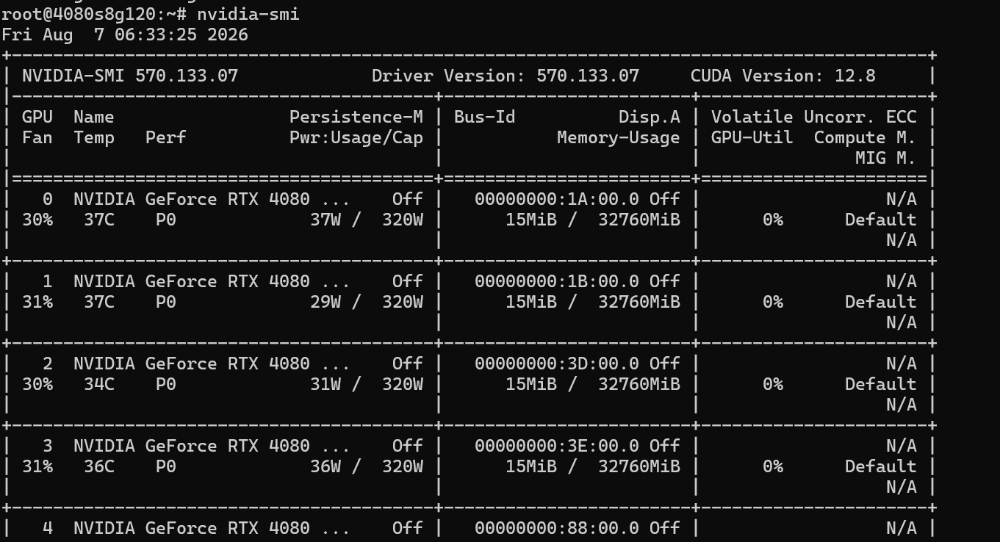

## 主题：NVIDIA GPU 硬件、驱动、CUDA

## 学习目标

- 学习 NVIDIA 显卡驱动和 CUDA 的安装流程
- 熟悉 nvidia-smi、dcgmi、nvcc、nccl-test 等常用命令和工具
- 学会判断显卡硬件是否健康

## 当日任务

1. 根据学习目标展开学习
2. 实操任务：

- 在 Ubuntu 平台实操 NVIDIA 驱动基于 RUN 包和 APT 的两种安装、卸载、升级流程（最终需要根据实操环境显卡选择合适的版本）
- 实操 CUDA 软件基于 RUN 包和 APT 的安装、卸载流程

3. 实操任务：

- 熟悉 nvidia-smi、dcgmi、nvcc、nccl-test 等命令/工具的使用
- 分别使用 dcgmi 和 gpu_burn 测试显卡健康状态，使用 nccl-test 测试显卡卡间通信性能（alltoall、all_reduce）

4. 实操任务：

- 熟悉通过 lspci、dmidecode 命令获取显卡 PCIe、slot 信息

---

## 我的进度

### 一、NVIDIA GPU 硬件基础

#### GPU 架构认知

NVIDIA 数据中心 GPU 主要系列：

| 架构代号  | 代表产品      | 特点                           |
| --------- | ------------- | ------------------------------ |
| Volta     | V100          | 首次引入 Tensor Core           |
| Turing    | T4            | 推理优化，INT8 支持            |
| Ampere    | A100/A800/HGX | 多实例 GPU（MIG），NVLink 3.0  |
| Hopper    | H100/H800     | Transformer Engine，NVLink 4.0 |
| Blackwell | B200          | 双芯架构，FP4 精度             |

GPU 在服务器中的物理形态主要有三种：

- PCIe GPU：标准 PCIe 插槽，类似显卡形态（如 RTX 3060/4090、Tesla T4）
- SXM GPU：专用 SXM 插座，通过 NVLink 互联（如 A100/H100 SXM 版本）
- OCP OAM：开放加速器模块，多用于 HGX 基板

#### GPU 关键指标

| 指标             | 含义                     | 查看方式           |
| ---------------- | ------------------------ | ------------------ |
| CUDA Cores       | 并行计算单元数量         | nvidia-smi -q      |
| Tensor Cores     | AI 加速专用单元          | GPU 架构文档       |
| VRAM             | 显存容量                 | nvidia-smi         |
| Memory Bandwidth | 显存带宽                 | nvidia-smi -q      |
| TDP/TGP          | 热设计功耗               | nvidia-smi -q      |
| PCIe Generation  | PCIe 代数（3.0/4.0/5.0） | lspci -vvv         |
| NVLink           | GPU 间直连通道           | nvidia-smi topo -m |

---

### 二、NVIDIA 驱动安装

#### 前置检查

```bash
# 1. 确认系统里有 NVIDIA GPU
lspci | grep -i nvidia
# 如果没输出，说明机器没有 NVIDIA 显卡，后面都不用做了

# 2. 看当前加载的是哪个驱动
lsmod | grep nouveau    # 开源驱动，装官方驱动前要禁用
lsmod | grep nvidia     # 官方驱动

# 3. 确认内核版本（后面装驱动要编译内核模块，版本要对上）
uname -r

# 4. 确认编译工具链是否就绪
gcc --version
# 如果没有 gcc，装一下：
sudo apt install -y build-essential linux-headers-$(uname -r)
```


> #### nouveau 开源驱动的意义
>
> ##### 1. 没有安装 NVIDIA 官方驱动的时候，系统能正常开机、显示画面
>
> 服务器如果没有装 nvidia 驱动，nouveau 可以做基础显示输出（BMC、显示器输出）。
> 如果没有 nouveau，没有装官方驱动，系统会黑屏、无显示。
>
> ##### 2. 自由开源，完全随内核发布，不需要 NVIDIA 闭源二进制
>
> nouveau 是内核主线代码，没有任何厂商私有代码。
>
> - 系统安装完开箱即用；
> - 内核升级自动跟随，不需要 DKMS 编译、不需要额外装包；
> - 适合只做桌面显示，不跑 CUDA、AI、计算任务。
>
> ##### 3.用于系统安装、救援模式
>
> Ubuntu 安装系统、系统救援模式，没有装 nvidia 私有驱动，全靠 nouveau 驱动显卡输出画面。
> 没有它，安装程序直接黑屏。
>
> ##### 4. 部分场景专门用 nouveau
>
> - 普通桌面轻度使用，不玩游戏、不跑 CUDA；
> - 追求完全开源内核，不想加载 NVIDIA 闭源内核模块；
>
> #### nouveau 的短板
>
> 为什么做 AI/CUDA要禁用 nouveau，上官方驱动：
>
> 1. 完全不支持 CUDA、NVML（nvidia‑smi）、DCGM，跑不了 GPU 计算；
> 2. 显卡性能很差，没有完整硬件加速；
> 3. 不支持高级特性：大显存管理、功耗调节、MIG、多卡 P2P 通信；
> 4. 新显卡支持滞后，40 系这类新卡 nouveau 支持很残缺。
>    结：nouveau 负责 “能点亮屏幕”；NVIDIA 官方驱动负责 “发挥显卡全部计算能力”。


这台服务器已经装了驱动 550，先确认它是哪种方式装的：


```bash
# 查安装方式
dpkg -l | grep nvidia-driver      # 有输出 → APT 装的
ls /usr/bin/nvidia-uninstall 2>/dev/null  # 存在 → RUN 包装的
```


结果：`dpkg -l | grep nvidia-driver` 没有记录，但 `/usr/bin/nvidia-uninstall` 存在 → 这个驱动是 RUN 包装的（带 `--dkms`）。

既然要重新装，先卸掉。

#### 方法一：APT 安装（推荐，适合生产环境）

APT 装驱动的好处是包管理器统一管理，内核升级时 DKMS 会自动重编译驱动模块，省心。

```bash
# 步骤 1：更新包索引
sudo apt update

# 步骤 2：查看系统推荐的驱动版本
ubuntu-drivers devices
# 输出会列出推荐版本，类似：
# driver   : nvidia-driver-535 - distro non-free
# driver   : nvidia-driver-550 - distro non-free recommended

# 步骤 3：安装推荐版本（或者指定版本）
sudo ubuntu-drivers autoinstall
# 如果要指定版本：sudo apt install -y nvidia-driver-550

# 步骤 4：禁用 nouveau 开源驱动
# APT 安装过程通常会自动处理，但保险起见手动确认一下
cat > /etc/modprobe.d/blacklist-nouveau.conf << 'EOF'
blacklist nouveau
options nouveau modeset=0
EOF
sudo update-initramfs -u

# 步骤 5：重启
sudo reboot

# 步骤 6：重启后验证
nvidia-smi
# 能正常输出 GPU 信息就说明装好了
```


```bash
sudo reboot
```



重启后 nvidia-smi 正常输出，驱动安装成功。

APT 安装的特点：

- 驱动自动编译为 DKMS 模块，内核更新时自动重编译
- 包管理器统一管理，卸载方便（`apt purge` 一条命令）
- 版本由 Ubuntu 仓库维护，可能不是最新的

#### 方法二：RUN 包安装（适合需要最新版）

RUN 包可以直接从 NVIDIA 官网下载指定版本，适合需要特定版本或者仓库里没有的场景。

```bash
# 步骤 1：下载驱动（从 NVIDIA 官网找对应版本）
# 这里以 535.183.01 为例，实际操作时换成你需要的版本
wget https://us.download.nvidia.com/XFree86/Linux-x86_64/535.183.01/NVIDIA-Linux-x86_64-535.183.01.run

# 步骤 2：停止图形界面（如果有）
# 服务器一般没有图形界面，桌面版 Ubuntu 需要执行：
sudo systemctl stop gdm3    # GNOME 桌面
# 或
sudo systemctl stop lightdm  # LightDM 桌面

# 步骤 3：禁用 nouveau
echo -e "blacklist nouveau\noptions nouveau modeset=0" | sudo tee /etc/modprobe.d/blacklist-nouveau.conf
sudo update-initramfs -u
sudo reboot

# 步骤 4：重启后确认 nouveau 已禁用
lsmod | grep nouveau
# 应该没有输出。如果有输出说明没禁干净，再检查一下 blacklist 文件

# 步骤 5：安装驱动
sudo chmod +x NVIDIA-Linux-x86_64-535.183.01.run
sudo ./NVIDIA-Linux-x86_64-535.183.01.run \
  --silent \
  --no-cc-version-check \
  --dkms
# --silent           : 非交互安装，不弹窗
# --no-cc-version-check : 跳过 gcc 版本检查（高版本 gcc 有时会误报）
# --dkms             : 注册为 DKMS 模块，内核更新时自动重编译

# 步骤 6：验证
nvidia-smi
```

RUN 包安装的特点：

- 可以安装最新版或特定版本驱动
- 内核更新后需要手动重新安装驱动模块（除非加了 `--dkms`）
- 不经过包管理器，卸载要手动跑 `nvidia-uninstall`

#### 驱动卸载

```bash
# APT 卸载（把版本号换成你实际装的）
sudo apt purge -y nvidia-driver-570
sudo apt autoremove

# RUN 包卸载
sudo nvidia-uninstall
# 或者用原来的安装包卸载
sudo ./NVIDIA-Linux-x86_64-535.183.01.run --uninstall

# 清理黑名单配置（如果不再需要禁用 nouveau）
sudo rm -f /etc/modprobe.d/blacklist-nouveau.conf
sudo update-initramfs -u
sudo reboot
```

#### 驱动升级

```bash
# APT 升级
sudo apt update
sudo apt upgrade nvidia-driver-535
sudo reboot

# RUN 包升级：直接用新版本的 .run 文件覆盖安装
sudo ./NVIDIA-Linux-x86_64-550.54.15.run --silent --dkms
```

---

### 三、CUDA 安装

#### CUDA 版本与驱动版本对应关系

装 CUDA 之前要先确认驱动版本够不够用，CUDA 对驱动有最低版本要求：

| CUDA 版本 | 最低驱动版本 | 说明       |
| --------- | ------------ | ---------- |
| CUDA 12.4 | &gt;= 550    | 最新稳定版 |
| CUDA 12.2 | &gt;= 535    | 广泛使用   |
| CUDA 12.1 | &gt;= 530    |            |
| CUDA 11.8 | &gt;= 520    | 兼容性好   |

```bash
# 查看当前驱动支持的最高 CUDA 版本
nvidia-smi
# 右上角会显示：CUDA Version: 12.4
# 注意：这里显示的是驱动支持的最高 CUDA 版本，不是你已经安装的 CUDA 版本
```

#### 方法一：APT 安装 CUDA Toolkit

```bash
# 步骤 1：添加 NVIDIA CUDA 软件源
# 先下载 keyring 包（用于验证软件包签名）
wget https://developer.download.nvidia.com/compute/cuda/repos/ubuntu2204/x86_64/cuda-keyring_1.1-1_all.deb
sudo dpkg -i cuda-keyring_1.1-1_all.deb
sudo apt update

# 步骤 2：安装 CUDA Toolkit（以 12.4 为例）
sudo apt install -y cuda-toolkit-12-4
# 这个包大概 3-4GB，安装时间取决于网速

# 步骤 3：配置环境变量
echo 'export PATH=/usr/local/cuda/bin:$PATH' >> ~/.bashrc
echo 'export LD_LIBRARY_PATH=/usr/local/cuda/lib64:$LD_LIBRARY_PATH' >> ~/.bashrc
source ~/.bashrc

# 步骤 4：验证安装
nvcc --version
# 预期输出：
# nvcc: NVIDIA (R) Cuda compiler driver
# Copyright (c) 2005-2024 NVIDIA Corporation
# Built on ...
# Cuda compilation tools, release 12.4, V12.4.xx
```

#### 方法二：RUN 包安装 CUDA Toolkit

```bash
# 步骤 1：下载 CUDA 安装包
wget https://developer.download.nvidia.com/compute/cuda/12.4.1/local_installers/cuda_12.4.1_550.54.15_linux.run

# 步骤 2：安装（只装 toolkit，不装驱动）
# 如果你已经单独装了驱动，一定要加 --toolkit 参数，否则会覆盖现有驱动
sudo sh cuda_12.4.1_550.54.15_linux.run --toolkit --silent --toolkitpath=/usr/local/cuda-12.4

# 步骤 3：配置环境变量
echo 'export PATH=/usr/local/cuda-12.4/bin:$PATH' >> ~/.bashrc
echo 'export LD_LIBRARY_PATH=/usr/local/cuda-12.4/lib64:$LD_LIBRARY_PATH' >> ~/.bashrc
source ~/.bashrc

# 步骤 4：创建软链接（方便多版本切换）
sudo ln -sf /usr/local/cuda-12.4 /usr/local/cuda

# 步骤 5：验证
nvcc --version
```

#### APT 和 RUN 包的区别

| 对比项     | APT                            | RUN 包               |
| ---------- | ------------------------------ | -------------------- |
| 安装路径   | /usr/local/cuda-XX.X           | 可自定义             |
| 多版本共存 | 支持，通过切换 /usr/local/cuda | 支持，通过切换软链接 |
| 依赖管理   | apt 自动解决                   | 需手动安装依赖       |
| 卸载       | apt purge                      | 运行 uninstall 脚本  |

#### CUDA 卸载

```bash
# APT 卸载
sudo apt purge -y cuda-toolkit-12-4
sudo apt autoremove

# RUN 包卸载
sudo rm -rf /usr/local/cuda-12.4
sudo rm -f /usr/local/cuda    # 删掉软链接
```

---

### 四、GPU 诊断工具使用

#### nvidia-smi — GPU 状态监控

nvidia-smi 是最基础也最常用的 GPU 监控工具，装完驱动就有。

```bash
# 查看 GPU 基本状态
nvidia-smi
```

输出大概长这样：

```
+-----------------------------------------------------------------------------+
| NVIDIA-SMI 535.183.01   Driver Version: 535.183.01   CUDA Version: 12.4     |
|-------------------------------+----------------------+----------------------+
| GPU  Name        Persistence-M| Bus-Id        Disp.A | Volatile Uncorr. ECC |
| Fan  Temp  Perf  Pwr:Usage/Cap|         Memory-Usage | GPU-Util  Compute M. |
|   0  NVIDIA RTX A6000    Off  | 00000000:01:00.0 Off |                  Off |
| 30%   35C    P0    65W / 300W |   2048MiB / 49140MiB |      5%      Default |
+-------------------------------+----------------------+----------------------+
| Processes:                                                                  |
|  GPU   PID   Type   Process name                             GPU Memory     |
|=============================================================================|
|    0  1234      C   python                                      1024MiB     |
+-----------------------------------------------------------------------------+
```

各字段含义：

- Temp：GPU 核心温度，正常 30-45°C 待机、60-85°C 满载，超过 90°C 要关注
- Perf：性能状态，P0 是最高性能，P12 是最低
- Pwr：当前功耗 / 最大功耗（TDP）
- ECC：错误校验校正，数据中心 GPU 才有
- GPU-Util：GPU 计算利用率

```bash
# 查询详细信息
nvidia-smi -q

# 只查特定字段，输出为 CSV 格式（方便脚本处理）
nvidia-smi --query-gpu=name,temperature.gpu,power.draw,utilization.gpu,memory.total,memory.used --format=csv

# 持续监控，每 1 秒刷新一次
watch -n 1 nvidia-smi
# 或者
nvidia-smi -l 1

# 查看进程级显存占用，采样 10 次
nvidia-smi pmon -c 10

# 查看 GPU 拓扑（多卡机器用来看 NVLink 连接关系）
nvidia-smi topo -m
# 输出示例：
#        GPU0  GPU1  GPU2  GPU3  CPU Affinity  NUMA Affinity
# GPU0    X    NV12  NV12  NV12  0-19          0
# GPU1   NV12   X    NV12  NV12  0-19          0
# GPU2   NV12  NV12   X    NV12  20-39         1
# GPU3   NV12  NV12  NV12   X   20-39         1
# NV12 表示 NVLink 12 条通道连接

# 导出完整信息为 JSON（适合写脚本自动分析）
nvidia-smi -q --json
```

#### dcgmi — NVIDIA 数据中心 GPU 管理工具

dcgmi 是 NVIDIA 官方的数据中心 GPU 管理工具，比 nvidia-smi 功能更强，支持健康诊断。

```bash
# 安装
sudo apt install -y datacenter-gpu-manager

# GPU 健康诊断，分 4 个等级，数字越大检查越深
sudo dcgmi diag -r 1    # 快速检查：驱动和设备是否可见
sudo dcgmi diag -r 2    # 中等检查：加上 PCIe/NVLink 带宽测试
sudo dcgmi diag -r 3    # 深度检查：加上 GPU 计算和内存压力测试
sudo dcgmi diag -r 4    # 全面检查：加上 ECC 测试（耗时最长）

# 查看 GPU 运行统计
dcgmi stats --display

# 查看拓扑信息（JSON 格式，方便脚本解析）
dcgmi topo --enum -j

# 查看单块 GPU 的健康状态
dcgmi health -g 0
```

#### nvcc — CUDA 编译器

```bash
# 查看版本
nvcc --version

# 编译一个 CUDA 程序
nvcc -O3 -o vector_add vector_add.cu

# 查看 CUDA 安装路径
which nvcc
ls /usr/local/cuda/
```

---

### 五、GPU 健康测试

#### gpu_burn — GPU 压力测试

gpu_burn 是一个简单好用的 GPU 压力测试工具，通过大量浮点运算把 GPU 跑满，检验是否有计算错误。

```bash
# 步骤 1：克隆源码并编译
git clone https://github.com/wilicc/gpu-burn
cd gpu-burn
make

# 步骤 2：运行测试
./gpu_burn         # 默认跑 10 秒
./gpu_burn 60      # 跑 60 秒，时间越长越能暴露问题

# 输出解读：
# Testing started on all GPUs...
# 50.0%  proc'd: 2 (4038 W) - errors: 0)
# 100.0%  proc'd: 2 (4038 W) - errors: 0)
# Killed!  <-- 测试正常完成
#
# 重点看 errors 这个数字，必须是 0
# 如果 errors > 0，说明 GPU 计算单元有问题，可能是硬件故障
```

#### 温度与功耗监控

跑压力测试的同时监控温度和功耗，可以判断散热是否正常：

```bash
# 后台记录 GPU 状态，每 5 秒采样一次
nvidia-smi --query-gpu=timestamp,name,temperature.gpu,power.draw,fan.speed --format=csv -l 5 > gpu_monitor.log &

# 跑压力测试 60 秒
./gpu_burn 60

# 停止后台监控
kill %1

# 查看日志
cat gpu_monitor.log
```

正常范围：

- 温度：待机 30-45°C，满载 60-85°C。超过 90°C 说明散热有问题
- 功耗：不应持续超过 TDP 额定值，否则可能触发降频
- 风扇：满载时应该加速到 60-100%

---

### 六、NCCL-Test — 卡间通信性能测试

NCCL（NVIDIA Collective Communications Library）是多 GPU 通信的标准库。nccl-test 用来测试 GPU 之间的通信带宽和延迟。

```bash
# 步骤 1：安装依赖
sudo apt install -y libnccl2 libnccl-dev

# 步骤 2：克隆并编译 nccl-tests
git clone https://github.com/NVIDIA/nccl-tests
cd nccl-tests
make MPI=1 MPI_HOME=/usr
# 如果没有 MPI 也可以不加 MPI=1，直接 make

# 步骤 3：运行测试
# all_reduce：最常用的集合通信，所有 GPU 归约求和
./build/all_reduce_perf -b 8 -e 256M -f 2 -g 2
# -b 8      : 起始数据量 8 bytes
# -e 256M   : 结束数据量 256 MB
# -f 2      : 步长倍数，每次数据量翻倍
# -g 2      : 使用 2 块 GPU

# alltoall：每个 GPU 给其他 GPU 发数据
./build/alltoall_perf -b 8 -e 256M -f 2 -g 2

# 带宽测试和延迟测试
./build/bw_perf -b 8 -e 256M -f 2 -g 2
./build/latency_perf -b 8 -e 256M -f 2 -g 2
```

测试结果怎么看：

| 通信类型   | 含义                       | 典型带宽                          |
| ---------- | -------------------------- | --------------------------------- |
| all_reduce | 所有 GPU 归约求和          | NVLink:&gt;100GB/s, PCIe: ~20GB/s |
| alltoall   | 每个 GPU 给其他 GPU 发数据 | 比 all_reduce 更考验互联带宽      |
| broadcast  | 一个 GPU 广播到所有 GPU    | 取决于互联拓扑                    |

带宽远低于预期的话，检查一下 GPU 之间走的是 NVLink 还是 PCIe，用 `nvidia-smi topo -m` 看拓扑。

---

### 七、GPU 硬件信息获取

#### lspci — PCIe 设备信息

```bash
# 列出所有 NVIDIA GPU 设备
lspci | grep -i nvidia
# 输出示例：
# 01:00.0 VGA compatible controller: NVIDIA Corporation GA102 [GeForce RTX 3090] (rev a1)

# 查看某块 GPU 的详细 PCIe 信息
lspci -vvv -s 01:00.0
# 重点看这两行：
# LnkCap:  Port #0, Speed 16GT/s, Width x16    ← 硬件支持的最大能力
# LnkSta:  Speed 16GT/s (ok), Width x16 (ok)   ← 当前实际运行状态
# 如果 LnkSta 显示 Width x8 而 LnkCap 是 x16，说明 PCIe 带宽受限了

# 批量查看所有 GPU 的 PCIe 状态
lspci -d 10de: -v | grep -E "VGA|3D|LnkSta"
```

#### dmidecode — 系统硬件信息

```bash
# 查看内存信息
sudo dmidecode -t memory | grep -E "Size|Speed|Type"
# 输出示例：
# Size: 32768 MB
# Speed: 3200 MT/s
# Type: DDR4

# 查看 PCIe 插槽信息（GPU 插在哪个 slot 上）
sudo dmidecode -t slot
# 输出示例：
# Designation: PCIe Slot 1
# Type: x16 PCI Express 4 x16
# Current Usage: In Use

# 查看主板信息
sudo dmidecode -t baseboard
```

---

### 八、实战经验与踩坑记录

#### 如何判断驱动是 APT 还是 RUN 包安装的

混装会导致驱动文件互相打架，装之前必须先确认当前是哪种方式装的：

```bash
# 方法 1：查包管理器记录（最直接）
dpkg -l | grep nvidia-driver
# 有输出 → APT 安装
# 无输出 → RUN 包安装（或者根本没装）

# 方法 2：查 RUN 包卸载脚本
ls /usr/bin/nvidia-uninstall
# 存在 → RUN 包安装

# 方法 3：查驱动内核模块的路径
find / -name "nvidia.ko*" 2>/dev/null
# /usr/lib/modules/*/updates/dkms/ 下 → APT + DKMS
# /usr/lib/modules/*/kernel/drivers/video/ 下 → RUN 包
```

#### 如何确定显卡驱动是否卸载干净

驱动残留是装新驱动出问题的首要原因。残留的 .so 库、DKMS 模块、X11 配置都可能让新驱动装不上或者装完重启进不了系统。

总体思路是三层验证：

| 层级               | 验证什么                                                | 什么时候查         |
| ------------------ | ------------------------------------------------------- | ------------------ |
| 第一层：包管理器   | apt/dpkg 里还有没有 nvidia 相关包                       | 卸载命令执行后立即 |
| 第二层：文件系统   | /usr/lib、/lib/modules 下还有没有残留的 .so 和 .ko 文件 | 卸载命令执行后立即 |
| 第三层：运行时内核 | lsmod 还有没有加载 nvidia 模块、nvidia-smi 能不能通信   | 重启后             |

第一层和第二层：卸载后立即检查，不用重启

```bash
# 1. 看包管理器记录
dpkg -l | grep -E "nvidia|cuda"
# 期望：没有输出
# 如果还有：sudo apt purge -y $(dpkg -l | grep -E "nvidia|cuda" | awk '{print $2}')

# 2. 看 DKMS 模块注册
dkms status
# 期望：没有 nvidia 相关条目
# 如果还有：sudo dkms remove nvidia/550.xx --all

# 3. 看驱动共享库文件
find /usr/lib /usr/lib64 /usr/local/lib -name "libnvidia*" 2>/dev/null
find /usr/lib /usr/lib64 /usr/local/lib -name "libcuda*" 2>/dev/null
# 期望：没有输出
# 如果有残留：sudo rm -f /usr/lib/x86_64-linux-gnu/libnvidia*

# 4. 看内核模块文件
find /lib/modules/$(uname -r) -name "nvidia*" 2>/dev/null
find /usr/lib/modules/$(uname -r) -name "nvidia*" 2>/dev/null
# 期望：没有输出
# RUN 包卸载后这里最容易残留，有的话必须手动删

# 5. 看 NVIDIA 专用目录和配置
ls -la /etc/nvidia/ 2>/dev/null
ls -la /usr/share/nvidia/ 2>/dev/null
ls -la /etc/X11/xorg.conf.d/*nvidia* 2>/dev/null
# 期望：目录不存在或者为空
# X11 残留配置会导致图形界面启动失败

# 6. 看 CUDA 软链接（如果也卸了 CUDA 的话）
ls -la /usr/local/cuda 2>/dev/null
ls -d /usr/local/cuda-* 2>/dev/null

# 7. 看 nvidia-persistenced 服务
systemctl status nvidia-persistenced 2>/dev/null
# 期望：显示 "not found" 或 "inactive"
# 如果还在跑：sudo systemctl disable --now nvidia-persistenced
```

第二层：重启后最终验证

```bash
# 8. 看内核模块加载状态
lsmod | grep nvidia
# 期望：没有输出

# 9. 最直接的判断：跑 nvidia-smi
nvidia-smi
# 期望报错：
# "NVIDIA-SMI has failed because it couldn't communicate with the NVIDIA driver."
# 看到这条报错 = 驱动确实卸干净了
# 如果还能正常显示 GPU 信息 = 驱动还在，没卸干净

# 10. 看 /proc 内核接口
cat /proc/driver/nvidia/version 2>/dev/null
# 期望报错："No such file or directory"

# 11. 看 nouveau 是否恢复
lsmod | grep nouveau
# 卸掉 nvidia 驱动后系统应该回退到 nouveau
# 如果 nouveau 也被禁了需要恢复：
# sudo rm /etc/modprobe.d/blacklist-nouveau.conf
# sudo update-initramfs -u && sudo reboot
```

常见残留场景对照：

| 场景                                  | 原因                           | 解决办法                                        |
| ------------------------------------- | ------------------------------ | ----------------------------------------------- |
| dpkg 清了但 /usr/lib 下还有 libnvidia | RUN 包卸载脚本不清理 .so       | 手动`rm /usr/lib/x86_64-linux-gnu/libnvidia*` |
| DKMS 还显示 nvidia 模块               | RUN 包用 --dkms 装的但没清理   | `dkms remove nvidia/版本号 --all`             |
| 重启后 nvidia-smi 还能用              | 内核模块还在内存里             | 查`/lib/modules/$(uname -r)` 残留的 .ko 文件  |
| 新驱动报 "already installed"          | /etc/nvidia/ 下有版本锁定文件  | `rm -rf /etc/nvidia/`                         |
| 图形界面启动失败                      | X11 xorg.conf 残留 nvidia 配置 | 删`/etc/X11/xorg.conf.d/*nvidia*`             |

#### APT 与 RUN 包混装的危害

| 混装后果                    | 原因                                                |
| --------------------------- | --------------------------------------------------- |
| nvidia-smi 正常但 nvcc 报错 | 两套 CUDA 版本冲突                                  |
| 内核升级后驱动挂了          | APT 的 DKMS 只编译了自己那套，RUN 包的模块没重编译  |
| apt upgrade 后显卡不能用了  | APT 自动升级覆盖了 RUN 包版本                       |
| 卸载不干净                  | apt purge 只删 APT 装的，RUN 包的残留还在           |
| 两个版本共存                | nvidia-smi 显示 535，但 lsmod 加载的是 RUN 装的 550 |

选一种方式，坚持用到底。生产环境推荐 APT，需要最新版才用 RUN 包。

#### 驱动安装/卸载后重启 SSH 断连排查

这是最常见的踩坑场景：装完驱动重启，SSH 连不上了。

```bash
# 先在本地用 -v 看详细错误信息
ssh root@IP -p 端口 -v

# 根据错误类型判断原因：
# Connection refused   → SSH 服务没启动 / 端口映射丢了
# Connection timed out → 网络不通 / 防火墙 DROP / 机器没启动完成
# Permission denied    → 认证方式问题（密码/密钥）
# Connection reset     → SSH 服务崩溃
```

下面这些操作需要通过管理员 VNC 或者控制台登录去执行：

```bash
# 1. SSH 服务没自启（最常见的情况）
sudo systemctl enable sshd
sudo systemctl start sshd

# 2. 端口映射规则丢了（比如 30120→22 这种 NAT 映射）
iptables -t nat -L -n
# 如果映射规则没了，需要找管理员重新配

# 3. 新内核启动失败进了 rescue 模式
uname -r                    # 看当前内核版本
ls /boot/vmlinuz-*          # 看有哪些内核可以选
# 如果进了 initramfs，需要在 GRUB 菜单选旧内核启动

# 4. 防火墙规则被重置
iptables -L -n
# 如果 SSH 端口（22）被 DROP 了：
sudo iptables -I INPUT -p tcp --dport 22 -j ACCEPT
```

教训：重启 GPU 服务器之前，养成习惯先跑 `systemctl enable sshd` 和 `iptables-save`，防止重启后连不上。

#### 安装驱动后系统无法正常启动

```bash
# 症状：重启后黑屏 / 进 initramfs / 进 emergency mode

# 原因 1：nouveau 没禁干净
# 解决：GRUB 菜单按 e 键编辑启动项，在 linux 行末尾加 nomodeset
#        Ctrl+X 启动，进系统后重新禁用 nouveau + update-initramfs -u

# 原因 2：驱动版本与内核不兼容
# 解决：GRUB 菜单选旧内核启动（Advanced options → 选旧版本）

# 原因 3：DKMS 编译失败
# 解决：查日志找原因
cat /var/lib/dkms/nvidia/*/build/make.log
# 常见原因：缺少 linux-headers 或 gcc 版本不匹配
```
