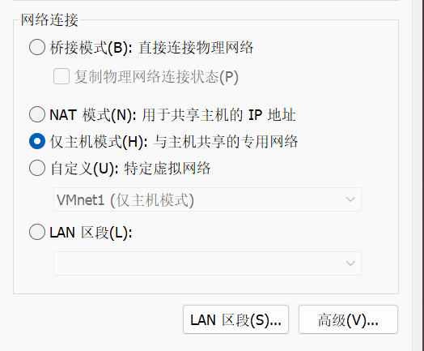
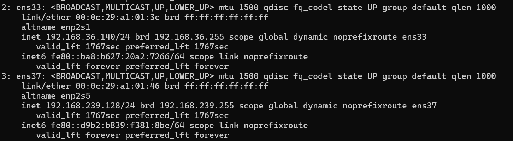
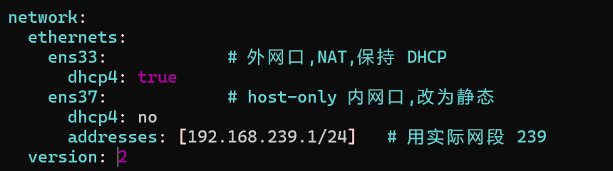
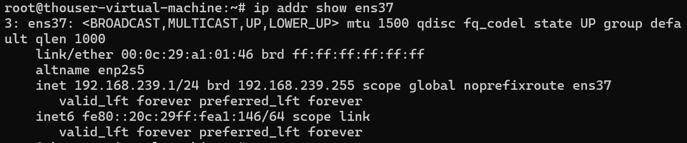
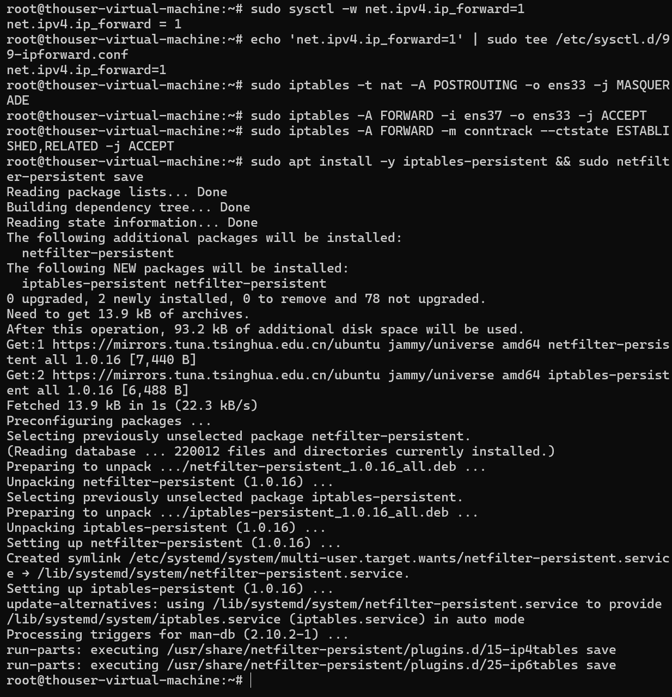
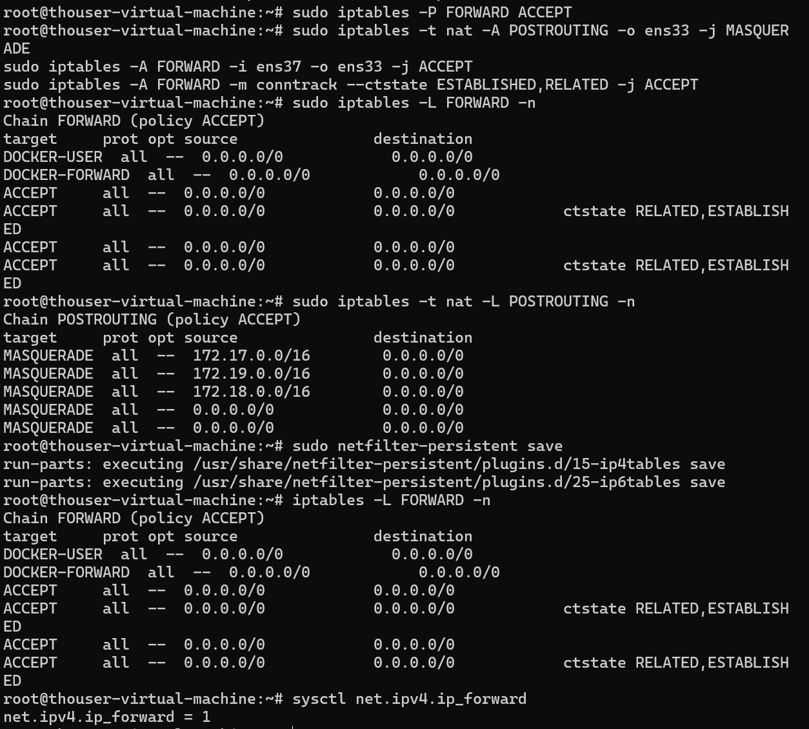
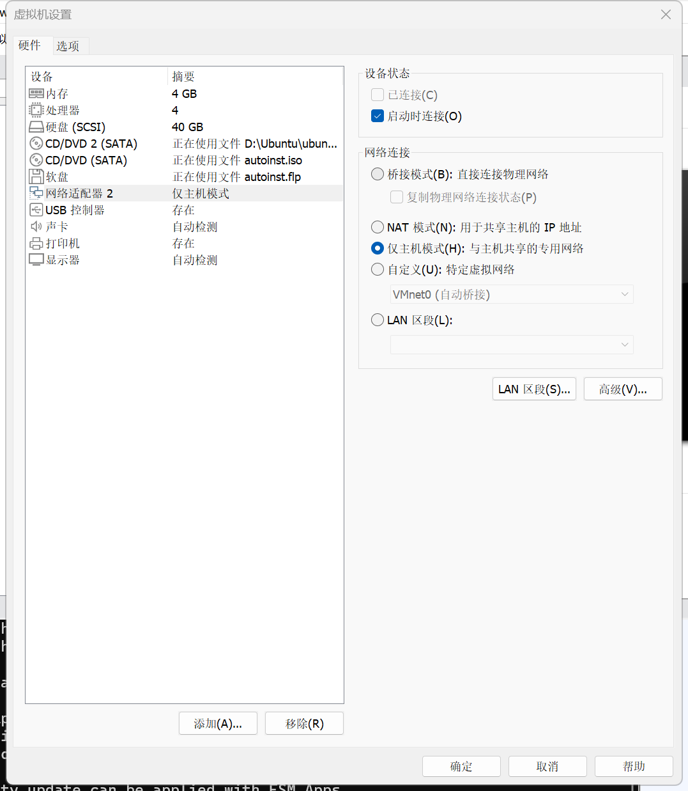
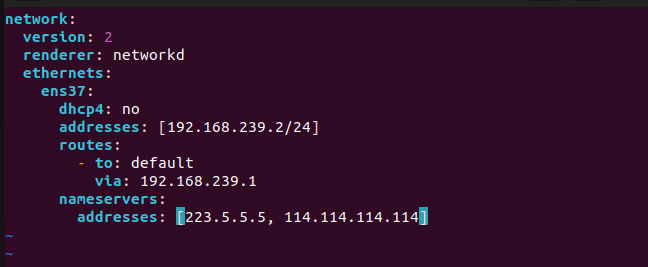
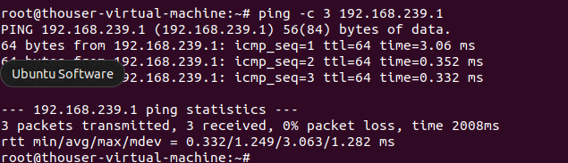
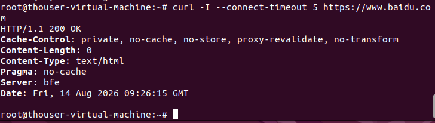

## 主题:用 iptables 实现网口流量转发——指定另一台 Ubuntu 的网口作为流量出口

## 学习目标

- 理解 iptables NAT 表的 POSTROUTING 链与 MASQUERADE 源地址伪装原理
- 掌握 Linux 内核 IP 转发开关(`net.ipv4.ip_forward`)的作用
- 掌握 Ubuntu 22.04 的 netplan 多网卡静态 IP 配置
- 理解 VMware 网络模式(NAT / host-only)在双机实验中的组合用法
- 掌握 VMware 克隆虚拟机后必须处理的问题(网卡、IP、SSH key、machine-id)
- 能独立搭建"一台 Ubuntu 指定另一台 Ubuntu 网口作为流量出口"的实验环境并验证

## 当日任务

1. 在 VMware 中安装一台 Ubuntu 22.04 虚拟机作为网关机(双网卡:外网口 NAT + 内网口 host-only)
2. 克隆网关机作为客户端虚拟机,改造克隆机:删除多余网卡、修改 IP、重置 SSH key 和 machine-id
3. 网关机开启内核 IP 转发,配置 iptables MASQUERADE 规则
4. 客户端默认网关指向网关机内网口
5. 验证:内网互通 → 跨网段转发 → 域名访问,并用 tcpdump 抓包确认流量经过网关机外网口
6. 反向验证:删除 MASQUERADE 规则后转发失效,证明转发由 iptables 实现

---

## 我的进度

### 一、实验原理

需求:VM-B 没有外网出口,指定 VM-A 的网口作为流量出口,即 VM-B 的所有出网流量都经 VM-A 转发。

数据包流转:

```
VM-B (192.168.239.2)
  │  发往外网的包,目标 MAC 是 VM-A 内网口
  ▼
VM-A 内网口 ens37 ──► FORWARD 链 ──► 外网口 ens33
                          │
                          └─ NAT 表 POSTROUTING:MASQUERADE
                             源地址 192.168.239.2 伪装成 ens33 的 IP
                             回程包再经 NAT 还原,发回 VM-B
```

三个必要条件:

| 条件                   | 作用                                        | 配置位置         |
| ---------------------- | ------------------------------------------- | ---------------- |
| VM-B 默认网关指向 VM-A | 让 VM-B 把非本网段流量都交给 VM-A           | VM-B 的 netplan  |
| VM-A 开启内核转发      | 内核默认丢弃非本机流量,必须`ip_forward=1` | VM-A 的 sysctl   |
| VM-A 做 NAT 伪装       | 内网源地址伪装成外网口地址,回包才能回来     | VM-A 的 iptables |

> 为什么必须 MASQUERADE?
> VM-B 的地址是私网地址(192.168.239.2),VM-A 转发出去后,外网服务器无法向这个私网地址回包。MASQUERADE 把源地址改成 VM-A 外网口地址,回包先回到 VM-A,再由 NAT 状态表还原成 VM-B 的地址送回。这是最常见的"内网借道上网"方案。

### 二、VMware 网络规划

| 网络              | 用途               | 说明                                                          |
| ----------------- | ------------------ | ------------------------------------------------------------- |
| VMnet8(NAT)       | VM-A 上外网        | VMware 自带,虚拟 DHCP,VM-A 外网口用它                         |
| VMnet1(host-only) | 两台虚拟机内网互通 | 网段以虚拟网络编辑器实际显示为准(本次实验是 192.168.239.0/24) |

虚拟机网卡分配:

- VM-A(网关机):2 块网卡 → 网卡1 选 NAT,网卡2 选 host-only(VMnet1)
- VM-B(客户端):由 VM-A 完整克隆而来,改造后保留 1 块 host-only 网卡

> VMware 添加网卡:虚拟机设置 → 添加 → 网络适配器 → 选网络连接方式。添加后虚拟机内要等系统识别,用 `ip addr` 确认新网卡名。

### 三、配置 VM-A(网关机,全新安装)

#### 1. 添加第二块网卡并确认网卡名称

VMware 设置 → 添加 → 网络适配器 → 仅主机模式(VMnet1)。



开机后:

```bash
ip addr
```

- ens33:有 DHCP 地址 → 外网口(NAT)
- ens37:新出现的网卡 → 内网口(host-only),此时还是 DHCP 分配的临时地址



#### 2. 给内网口配静态 IP

```bash
sudo vim /etc/netplan/00-installer-config.yaml
```

```yaml
network:
  ethernets:
    ens33:            # 外网口,NAT 模式,DHCP 即可
      dhcp4: true
    ens37:            # 内网口,静态 IP,作为 VM-B 的网关
      dhcp4: no
      addresses: [192.168.239.1/24]
  version: 2
```



```bash
sudo netplan apply
ip addr show ens37
```

验证静态生效:

```bash
# 之前(DHCP):inet 192.168.239.128/24 ... scope global dynamic noprefixroute
#             valid_lft 1767sec   ← 租约倒计时
# 之后(静态):inet 192.168.239.1/24 ... scope global noprefixroute
#             valid_lft forever   ← 永久
```

`dynamic` 关键字消失 + `valid_lft forever` = 静态配置生效。



#### 3. 开启内核 IP 转发(关键开关)

```bash
# 立即生效
sudo sysctl -w net.ipv4.ip_forward=1

# 永久生效
echo 'net.ipv4.ip_forward=1' | sudo tee /etc/sysctl.d/99-ipforward.conf
```

验证:`sysctl net.ipv4.ip_forward` 输出 1 即生效。

#### 4. 配置 iptables 转发规则(核心)

```bash
# 从内网口进来、从外网口出去的流量做源地址伪装
sudo iptables -t nat -A POSTROUTING -o ens33 -j MASQUERADE

# 放行 FORWARD 链:内网→外网 和 回程流量
sudo iptables -A FORWARD -i ens37 -o ens33 -j ACCEPT
sudo iptables -A FORWARD -m conntrack --ctstate ESTABLISHED,RELATED -j ACCEPT
```

规则解释:

| 规则                                                                | 表/链                 | 含义                                           |
| ------------------------------------------------------------------- | --------------------- | ---------------------------------------------- |
| `-t nat -A POSTROUTING -o ens33 -j MASQUERADE`                    | nat 表 POSTROUTING 链 | 所有从 ens33 出去的包,源地址伪装成 ens33 的 IP |
| `-A FORWARD -i ens37 -o ens33 -j ACCEPT`                          | filter 表 FORWARD 链  | 允许从内网口进、外网口出的转发流量             |
| `-A FORWARD -m conntrack --ctstate ESTABLISHED,RELATED -j ACCEPT` | filter 表 FORWARD 链  | 允许回程流量(外网响应回来的包)                 |



#### 5. 【踩坑】Docker 会把 FORWARD 策略改成 DROP

现象:配完规则后,查 FORWARD 链发现:

```bash
sudo iptables -L FORWARD -n
# Chain FORWARD (policy DROP)   ← Docker 改的!
# target     prot opt source    destination
# DOCKER-USER  all  --  0.0.0.0/0  0.0.0.0/0
# DOCKER-FORWARD  all  --  0.0.0.0/0  0.0.0.0/0
```

原因:本机装了 Docker。Docker 安装后会往 iptables 注入自己的规则链(DOCKER-USER / DOCKER-FORWARD),并把 FORWARD 默认策略改成 DROP。策略 DROP 意味着所有转发流量默认丢弃,我们的转发必然失败。

解决:把 FORWARD 策略改回 ACCEPT:

```bash
sudo iptables -P FORWARD ACCEPT
```

> 生产环境不要这么干,应该用白名单规则精确放行,改全局策略会让 Docker 容器网络隔离变宽松。实验环境无所谓。



#### 6. 保存规则(重启后生效)+ 关闭防火墙

```bash
sudo apt install -y iptables-persistent
sudo netfilter-persistent save
sudo ufw disable   # 实验阶段直接关闭,避免规则干扰
```

### 四、克隆 VM-B(客户端,克隆自 VM-A)

#### 1. VMware 完整克隆

VMware 中:右键 VM-A → 管理 → 克隆 → 创建完整克隆(不要链接克隆,链接克隆与母机共享磁盘,后续独立改动受限)。克隆时 VM-A 需处于关机状态。

#### 2. 克隆后、开机前:删除 NAT 网卡

VM-A 是双网卡(NAT + host-only),克隆出来的 VM-B 默认也是双网卡。必须删掉 NAT 那张,只保留 host-only 模式——否则 VM-B 自己就能通过 VMware 的 NAT 上网,流量根本不会走 VM-A,转发实验是假的。



#### 3. 开机后:确认克隆机状态,处理克隆遗留问题

判断是不是克隆机:看网卡 MAC。克隆时 VMware 会重新生成 MAC:

```bash
ip addr
# ens37 link/ether 00:0c:29:8e:a5:c1  ← 和母机(00:0c:29:a1:01:46)不同 → 确认是克隆机
```

【踩坑】克隆机 IP 和母机一模一样:克隆复制了母机的 netplan 配置,所以克隆机的 ens37 还是 `192.168.239.1`,和 VM-A 同网段冲突!必须改成 192.168.239.2。

克隆遗留处理:

```bash
# ① 改主机名,方便区分两台机器
sudo hostnamectl set-hostname vm-b

# ② 重新生成 SSH host key(克隆机与母机指纹完全相同,同网段会冲突)
sudo rm /etc/ssh/ssh_host_* && sudo ssh-keygen -A

# ③ 重置 machine-id(克隆机与母机相同,部分服务会异常)
sudo rm /etc/machine-id && sudo systemd-machine-id-setup
```

#### 4. 【踩坑】Netplan 有两个配置文件,NetworkManager 接管网络

现象:`ls /etc/netplan/` 显示两个文件:

```bash
00-installer-config.yaml        # 我们改的
01-network-manager-all.yaml     # renderer: NetworkManager,让 NM 接管所有网卡
```

只改 00 文件里的 `addresses` 但没写 `routes`,且 01 文件存在时,会出现:IP 改成功但默认路由不生效,`ip route` 里没有 `default via`。

解决:移走 01 文件,重写 00 文件,显式指定 networkd 渲染器并补齐 routes:

```bash
# ① 移走 NetworkManager 配置(VM-B 只有一块网卡,统一用 networkd 管最干净)
sudo mv /etc/netplan/01-network-manager-all.yaml /etc/netplan/01-network-manager-all.yaml.bak

# ② 重写 00-installer-config.yaml
sudo nano /etc/netplan/00-installer-config.yaml
```

```yaml
network:
  version: 2
  renderer: networkd
  ethernets:
    ens37:
      dhcp4: no
      addresses: [192.168.239.2/24]
      routes:
        - to: default
          via: 192.168.239.1
      nameservers:
        addresses: [223.5.5.5, 114.114.114.114]
```

```bash
# ③ 应用并验证
sudo netplan apply
ip route
# 应看到:default via 192.168.239.1 dev ens37 proto static
```



期间的 WARNING 解释(都无害):

- `Permissions for /etc/netplan/... are too open` → 顺手 `chmod 600` 即可
- `Cannot call Open vSwitch: ovsdb-server.service is not running` → 系统没装 OVS,无关
- `systemd-networkd is not running, output will be incomplete` → 之前是 NetworkManager 接管,首次切到 networkd 的过渡警告,它会自动硬重启 networkd

```bash
# 确保重启后 networkd 自启
sudo systemctl enable systemd-networkd
```

### 五、验证(重点)

#### 1. 内网互通

```bash
# VM-B 上执行
ping -c 3 192.168.239.1
# 64 bytes from 192.168.239.1: icmp_seq=1 ttl=128 time=0.402 ms  ← 通
```



#### 2. 跨网段转发

```bash
# VM-B 上执行
ping -c 3 8.8.8.8
```

【踩坑】ICMP 测试结果会误导:

- `8.8.8.8`(Google DNS):通但限流,3 个包可能只回 1-2 个,看着像"不稳定"
- `114.114.114.114`(114 DNS):完全禁 ping,100% loss 但网络其实是通的
- 结论:判断转发是否成功,以 TCP 测试为准,不要用 ping:

```bash
# VM-B 上执行
curl -I https://www.baidu.com
# HTTP/1.1 200 OK  ← 这才是转发成功的铁证(DNS 解析 + TCP 转发 + 回包全通)
```



#### 3. 抓包确认流量经过 VM-A 外网口

VM-A 上开两个抓包窗口:

```bash
# 窗口1:看 VM-B 的包有没有进内网口
sudo tcpdump -i ens37 icmp

# 窗口2:看包有没有从外网口出去(注意源地址被伪装)
sudo tcpdump -i ens33 icmp
```

VM-B 上 ping 8.8.8.8,VM-A 上看到:

```
# ens37(内网口):
IP 192.168.239.2 > dns.google: ICMP echo request      ← VM-B 的请求进来
IP dns.google > 192.168.239.2: ICMP echo reply       ← 回包回来

# ens33(外网口):
IP 192.168.36.140 > dns.google: ICMP echo request     ← 源地址已伪装成 VM-A 的 IP!
IP dns.google > 192.168.36.140: ICMP echo reply
```

这就是转发链路完整的铁证:内网口进、外网口出、源地址被 MASQUERADE 伪装、回包原路返回。

#### 4. 反向验证(证明是 iptables 的功劳,报告最有说服力的一步)

```bash
# VM-A 上删除 MASQUERADE 规则
sudo iptables -t nat -D POSTROUTING -o ens33 -j MASQUERADE

# VM-B 上 curl → 失败/超时(断网)
curl -I --connect-timeout 5 https://www.baidu.com

# VM-A 上加回规则
sudo iptables -t nat -A POSTROUTING -o ens33 -j MASQUERADE

# VM-B 上 curl → 恢复 200 OK
curl -I --connect-timeout 5 https://www.baidu.com
```


---

## 学习心得

1. VMware 的 VMnet8(NAT)本身就是一个现成的 SNAT 实现——宿主机对虚拟机做地址伪装。本实验相当于在 VM-A 上手动用 iptables 实现了一遍同样的机制,理解了 NAT 模式的底层原理
2. iptables 做转发三要素缺一不可:网关机开转发(sysctl)、放行 FORWARD 链、做 NAT 伪装。漏掉任何一环都转发不了
3. MASQUERADE vs SNAT:外网口 IP 是 DHCP 动态获取时用 MASQUERADE(自动取出口地址);固定 IP 时可用 `SNAT --to-source <固定IP>`,性能略好且日志里能看到真实内网源 IP
4. 克隆虚拟机 = 系统级复制,坑全在"一模一样"上:
   - 网卡配置一模一样 → 必须删多余的 NAT 网卡,否则克隆机直连外网,转发实验失去意义
   - IP 一模一样 → 同网段冲突,必须改 IP(判断是不是克隆机:看 MAC 是否与母机不同)
   - SSH host key、machine-id 一模一样 → 同网段指纹冲突、服务异常,必须重置
5. 装了 Docker 的机器做网关有隐藏坑:Docker 会把 FORWARD 默认策略改成 DROP,转发直接失败。先查 `iptables -L FORWARD -n` 的 policy,是 DROP 就 `iptables -P FORWARD ACCEPT`
6. netplan 双文件冲突:Ubuntu 桌面版默认带 `01-network-manager-all.yaml`(NetworkManager 接管),和手写配置打架会导致"IP 改了但路由不生效"。实验机直接移走该文件,统一用 networkd
7. 验证网络转发用 TCP 不用 ICMP:114.114.114.114 禁 ping、8.8.8.8 限流,ping 结果会误导判断;`curl` 返回 200 才是转发成功的铁证
8. 排查思路:先 `ping 网关` 确认内网通 → `curl 外网` 确认转发通 → 不通就用 `tcpdump` 分别抓内外网口,看包走到哪一步断了,逐层定位
9. 易踩坑:
   - netplan 语法错误会导致网络全断,先用 `sudo netplan try` 验证再 `apply`
   - iptables 规则重启即失,必须 `netfilter-persistent save`
   - 网卡名不是固定的,永远以 `ip addr` 实际输出为准
   - 网段不是固定的,永远以虚拟网络编辑器 + `ip addr` 实际为准
   - 克隆务必选"完整克隆",链接克隆和母机共享磁盘,后续不好独立操作
