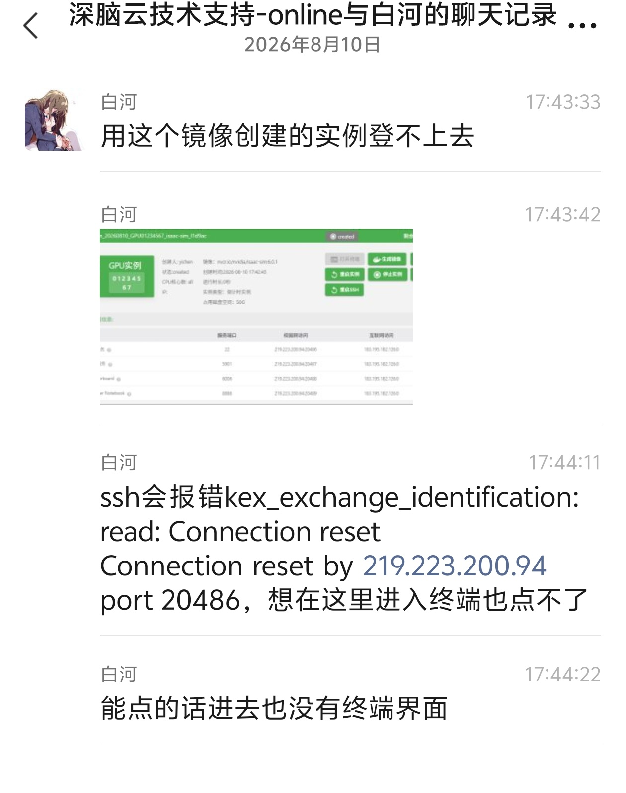
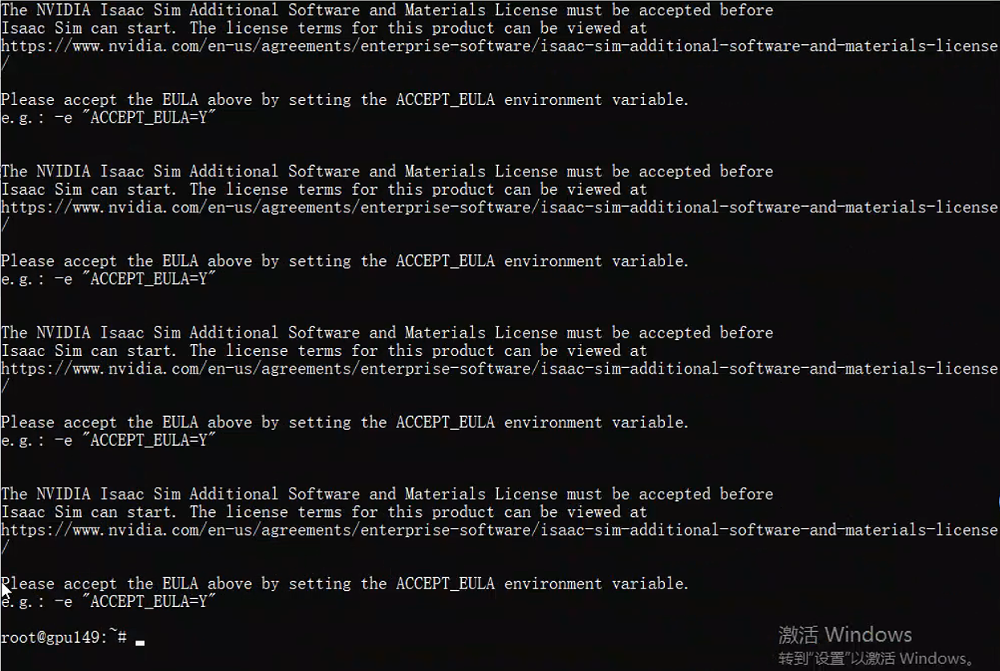
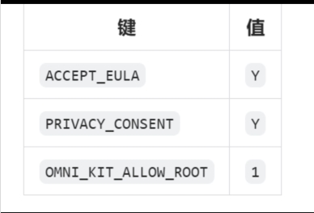

## 简介

在深脑云 GPU 节点上拉取 NVIDIA Isaac Sim 镜像并创建容器实例，解决镜像拉取和容器启动过程中遇到的问题。

## 预期结果

1. 成功拉取 `nvcr.io/nvidia/isaac-sim:6.0.1` 镜像
2. 成功创建并启动 Isaac Sim 容器
3. SSH、VNC 等服务端口正常可用

---

## 风险预警

等级：低

- 拉取镜像需要下载约 10-15GB 数据，占用磁盘空间和网络带宽
- 创建容器会占用 GPU 资源，影响该节点其他实例
- 操作本身不影响现有系统，可随时删除容器释放资源

---

## 环境

| 项目        | 内容                                 |
| ----------- | ------------------------------------ |
| 目标节点    | 219.223.200.94（北大深袁粒，gpu149） |
| GPU         | RTX 4090                             |
| 操作系统    | Linux（Ubuntu）                      |
| Docker 版本 | 24.x                                 |
| 镜像        | `nvcr.io/nvidia/isaac-sim:6.0.1`   |

注意事项：

1. jumpserver 如果一直网络波动在加载，开梯子
2. 北大的机器要使用 ToDesk 远程连接，不能用跳板机（所以第一条用不上），然后要在资产表中找到 SSH 的 IP 地址

---

## 详细操作文档

## 一、环境检查

```bash
# 检查 Docker 版本
docker --version

# 检查 Docker 服务状态
sudo systemctl status docker

# 检查磁盘空间（镜像约 10-15GB，至少需要 20GB 可用）
df -h

# 检查网络连通性
ping -c 3 nvcr.io

# 检查 GPU 状态
nvidia-smi
```

## 二、拉取镜像

```bash
docker pull nvcr.io/nvidia/isaac-sim:6.0.1
```

镜像约 10-15GB，下载时间取决于网络带宽。

## 三、验证拉取结果

```bash
docker images | grep isaac-sim
```

## 问题记录：

用户反馈：



排查过程：

1. 查看容器日志：`docker logs`
2. 日志显示需要接受许可协议

原因：缺少环境变量 `ACCEPT_EULA=Y`，Isaac Sim 启动前必须接受 NVIDIA 许可协议。



解决方案：创建容器时添加以下环境变量：

```
ACCEPT_EULA=Y
PRIVACY_CONSENT=Y
OMNI_KIT_ALLOW_ROOT=1
```

加了这个环境变量后手动跑了次容器，能telnet成功

```bash
docker run -d \
  --gpus all \
  -e "ACCEPT_EULA=Y" \
  -e "PRIVACY_CONSENT=Y" \
  -e "OMNI_KIT_ALLOW_ROOT=1" \
  -p 20486:22 \
  -p 20487:5901 \
  -p 20488:6006 \
  -p 20489:8888 \
  --name isaac-sim \
  --restart unless-stopped \
  nvcr.io/nvidia/isaac-sim:6.0.1
```

所以在平台上加环境变量



环境变量说明：

| 变量名              | 值 | 含义                               |
| ------------------- | -- | ---------------------------------- |
| ACCEPT_EULA         | Y  | 接受 NVIDIA 软件许可协议           |
| PRIVACY_CONSENT     | Y  | 同意 NVIDIA 隐私政策               |
| OMNI_KIT_ALLOW_ROOT | 1  | 允许以 root 用户运行 Omniverse Kit |

## 使用反馈

1. Isaac Sim 官方镜像启动前必须接受 EULA，如果云平台如果无法添加环境变量，可以考虑用 `docker commit` 将环境变量烤入镜像
2. 容器启动较慢，需要耐心等待 health 状态变为 healthy
