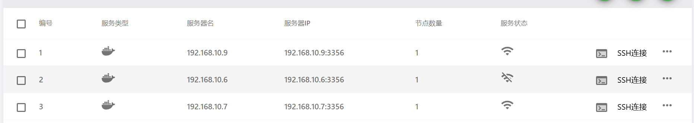
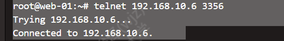

## 简介

DBCLOUD lab平台网页上192.168.10.6节点显示断连，实例状态异常。经排查确认节点本地服务正常，根因为平台侧与节点间3356端口的Docker TLS API证书不匹配。重新生成节点证书并同步到平台侧后恢复。

## 预期结果

节点状态恢复正常，平台能正常调度该节点的实例。

---

## 风险预警

中

- 在节点上运行dockerert.sh会重启docker服务，运行中的容器会短暂中断（约10-30秒），但容器不会丢失，重启后自动恢复
- 证书覆盖操作如果目标目录选错，会影响其他节点
- 操作前务必备份旧证书

---

## 环境

- 平台服务器（web-01）：10.80.29.7（兼192.168.10.1网关，平台容器dbcloudlab600/dbcloudone后端）
- 故障节点：192.168.10.6（node-v01，同济）
- 对照节点：192.168.10.7（node-v02，正常）
- 节点SSH端口：15654（lab_env.sh默认修改）
- Docker daemon配置：`--tlsverify -H tcp://0.0.0.0:3356`
- 平台证书目录结构：`/opt/dbcloud/lab_data/dbcloudlab/data/tls/{节点编号}/`

---

## 问题截图

平台网页上192.168.10.6节点显示"断连"，该节点上的实例显示"状态异常"。
--------------------------------------------------------------------



## 详细操作文档

### 1. 排查节点本地状态

SSH登录节点192.168.10.6（端口15654），确认本地服务是否正常：

```bash
# 系统运行时长（排除重启导致的断连）
uptime
# 输出：up 23:30，说明节点未重启过（后确认约24小时前有过一次重启）

# 守护进程状态
supervisorctl status
# 关键结果：
#   shell2http_services   RUNNING   pid 3392
#   gpu_ins_service       RUNNING   pid 3377
#   vncc / vncc_insts / vnccs  RUNNING
#   nfschk                FATAL     Exited too quickly（历史遗留，非本次根因）

# Docker daemon状态
systemctl status docker --no-pager | head -5
# Active: active (running)，--tlsverify ... -H tcp://0.0.0.0:3356

# 确认2388和3356端口在监听
ss -lntp | grep -E '2388|3356'
# 2388: shell2http在监听 
# 3356: dockerd在监听 

# 实例真实状态
docker ps -a | grep -c "Up "
# 大部分容器在运行（Up 24 hours），有11个Exited(0)的旧容器
```

结论：节点本地服务全部正常，问题在平台到节点的访问链路。

### 2. 排查网络层——平台能否访问节点3356

在平台服务器（web-01，10.80.29.7）上测试：

```bash
# 宿主机直测节点3356
telnet 192.168.10.6 3356
# Connected  TCP层通

# 平台容器内测3356
docker exec dbcloudlab600 bash -c "timeout 3 bash -c 'echo > /dev/tcp/192.168.10.6/3356' && echo TCP_OK || echo TCP_FAIL"
# TCP_OK  容器到节点的网络也通
```



结论：网络层没问题，断点在TLS认证层。

### 3. 更新节点证书（在节点192.168.10.6上操作）

运行dockerert.sh重新生成全套TLS证书：

```bash
# 节点.6上
bash /root/dockerert.sh
# 提示输入IP时填：192.168.10.6
# 脚本自动：生成新CA→生成server证书→生成client证书→修改docker.service→重启docker

# 验证docker已恢复
systemctl status docker --no-pager | head -5
# Active: active (running) 

# 确认3356在监听
ss -lntp | grep 3356
# LISTEN *:3356  dockerd 

# 确认服务状态
supervisorctl status
# 所有关键服务RUNNING（nfschk历史FATAL不影响）
```

### 4. 同步证书到平台侧

新生成的证书在节点 `/etc/docker/certs/` 下，需要将 ca.pem、cert.pem、key.pem 三个文件同步到 web-01 平台侧对应的 tls 目录。

通过公网机器中转（节点直接scp到公网机器，再从公网机器传到web-01）：

```bash
# 节点.6上，推送证书到公网机器（有密钥认证）
scp -P 15654 /etc/docker/certs/ca.pem /etc/docker/certs/cert.pem /etc/docker/certs/key.pem root@47.101.185.34:/tmp/

# 在web-01上，从公网机器拉取（或直接从节点scp到web-01）
# 覆盖到平台侧对应的tls目录
cp ca.pem cert.pem key.pem /opt/dbcloud/lab_data/dbcloudlab/data/tls/11/
```

### 5. 重启平台容器并验证

```bash
# web-01上
docker restart dbcloudlab600
```

刷新平台网页，192.168.10.6节点状态恢复正常，实例状态正常。

### 6. 排查过程中排除的非根因项

排查过程中检查了以下链路，均非本次断连根因，记录备查：

- vncc隧道/frps：节点vncc连10.80.29.7:7000报connection refused，web-01上确认frps进程不存在、7000无监听。但这条链路可能是历史遗留（socat方案替代），非本次根因。
- socat转发：web-01上socat 40001→.6:20074，节点20074端口无监听。但平台判定断连不依赖此端口。
- nfschk FATAL：历史遗留问题，非本次断连原因。
- admin_v100_max_2端口映射为空：该容器创建时即无端口映射，与断连无关。
- iptables NAT规则：web-01只有docker容器DNAT，无到节点的转发规则，平台直连节点。

---

## 使用反馈

- dockerert.sh运行时docker会短暂重启，容器中断约10-30秒，但不会丢失，重启后自动恢复
- 证书更新后必须同步到平台侧对应的tls目录，只更新一边无效
