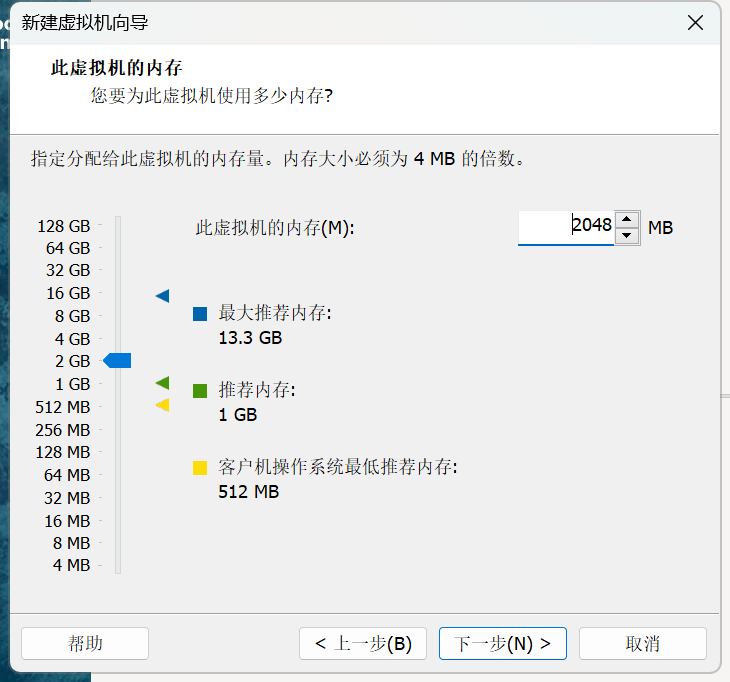
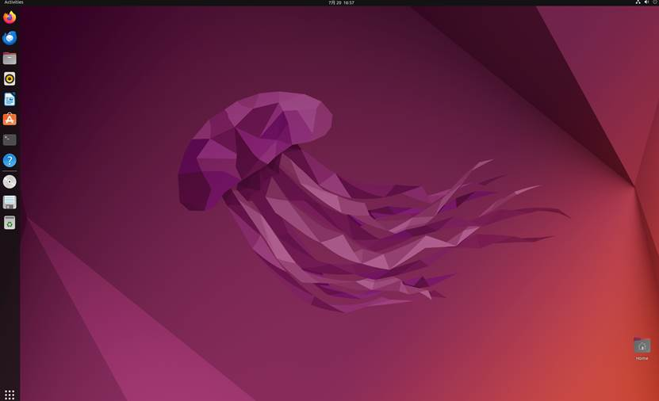

## 主题：Linux / Ubuntu 基础与系统安装认知

## 学习目标：基于Ubuntu22.04，Rocky Linux 9.8 学习、服务器开机启动流程、系统结构、目录结构、基础命令。

## 当日任务：

1. 根据学习目标展开学习

2. 实操任务：

    - 本地虚拟机实操安装Rocky Linux 9.8系统作为后续学习本地测试环境对比学习

    - 使用本地虚拟机实操安装ubuntu22.04系统（要求内核版本6.8.x）作为后续学习主要本地测试环境（熟悉ubuntu安装界面所有选项配置项）

    - 丢失root密码该如何重置

## 我的进度：

### 安装

#### Rocky Linux 9.8

点击下载Rocky Linux 9.8


DVD ISO和Minimal ISO区别

|对比项|Minimal ISO|DVD ISO|
|---|---|---|
|镜像体积|~2GB|~14GB|
|是否自带全套软件|仅基础系统，无额外包|内置完整软件仓库|
|安装是否需要网络|必须联网|可完全断网离线安装|
|可选安装环境|仅最小命令行|最小 / 带 GUI / 工作站 / 虚拟化全部可选|
|后续离线扩容|不行，必须联网|挂载 ISO 即可离线装桌面、开发工具|

Vmware中安装





之后都是默认

虚拟机配置


成功登录


配置允许远程ssh登录

```Shell
#1. 修改 SSH 服务配置文件
vi /etc/ssh/sshd_config
#找到下面两行，修改为如下值：
#PermitRootLogin yes
#PasswordAuthentication yes
#若行前有#注释符，必须删掉#才会生效。
#2. 重启 sshd 服务加载新规则
systemctl restart sshd
```

成功远程登录


#### Ubuntu 22.04

安装Ubuntu


成功登录



修改内核为内核版本 6.8.x

```Shell
sudo apt update
sudo apt install linux-generic-hwe-22.04
sudo reboot
```


### 丢失root密码该如何重置

##### Rocky Linux 9.8

步骤 1：重启虚拟机，调出 GRUB 引导菜单

开机瞬间长按 `Shift`，出现系统内核选项界面。

步骤 2：修改内核启动参数

选中第一条内核，按 `e` 进入编辑模式：

找到以 `linux16` 开头的长行；


在这里找到以 `ro` 开头的行并在末尾添加参数 `rd.break`，如图所示，然后按 `Ctrl + x` 键。

进入紧急模式，按 `Enter` 键进入 shell 提示符。现在，确保重新挂载了具有读写权限的 `sysroot` 目录。默认情况下，它以只读模式安装，指示为 `ro`。

```Bash
mount | grep sysroot
```


现在重新挂载具有读写权限的 `sysroot` 目录并再次确认权限。请注意，这次权限已从 `ro`（只读）更改为 `rw`（读取和写入）

```Bash
# mount -o remount,rw /sysroot/# mount | grep sysroot
```


接下来，使用以下命令以读写模式挂载根文件系统。

```Bash
chroot /sysroot
```

接下来，使用 `passwd` 命令用新密码重置 root 密码并确认。

```Bash
passwd
```

成功重置 root 用户密码。唯一剩下的部分是使用准确的 SELinux 上下文重新标记所有文件。

```Bash
touch /.autorelabel
```


最后，输入 `exit` 并注销以启动 SELinux 重新标记过程，退出并重启

```Plain Text
exit
exec /sbin/init
```

系统自动重启，SELinux 会自动重新标记文件，等待开机后用新密码登录。

> 普通用户 thouser 忘记密码：同样进单用户，执行 `passwd thouser` 重置。

##### Ubuntu 22.04

进入 GRUB 菜单后，使用箭头键导航到 Ubuntu 条目，然后按"e"键编辑 grub 参数。


向下滚动，直到到达以 'linux 开头的行，整行在下面突出显示。

将代码行中的 "ro quiet splash $vt_handoff" 替换为 "rw init=/bin/bash"，这样做的目的是利用 "rw" 前缀来实现对根文件系统的读写权限设置。


按 ctrl + x 重新启动系统。

系统将启动至 root shell 屏幕，可以通过运行该命令确认根文件系统具有读写访问权限。下图确认了 rw 表示的读写访问权限。

```Shell
mount | grep -w /
```


以读写模式挂载根文件系统后，您现在可以使用 passwd 命令重置根密码：

```Shell
passwd
```


可以看到修改成功

重置 root 密码后，最好以只读模式重新挂载根文件系统，以增强系统安全性。

```Shell
mount -o remount,ro /
```

最后重启系统

```Shell
exec /sbin/init
```
