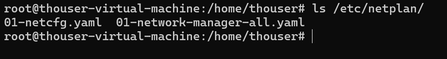

## 主题：网络基础、路由与常用诊断命令，SSH/SCP/SFTP 与基础网络安全

## 学习目标：补强 TCP/IP、TCP/UDP、DNS、路由、网关、ping/ss/nc/traceroute。掌握 SSH 连接链路、SCP/SFTP、安全配置、iptables/firewalld 基础。

## **当日任务：**

1. 根据学习目标展开学习

2. 实操任务1：

    - 服务器网络配置（netplan管理，ip命令手动配置，nmcli管理，networkmanager管理）
    - 理解VMware虚拟机的网络模式，配置虚拟机网络在办公室同一wifi下能够让其他人ssh连接。

3. 实操任务2：

    - 使用iptables命令设置所有端口数据包默认丢弃，后再放开需要外部访问的端口

4. 实操任务3：

    - 修改ssh配置文件，关闭密码登录并开启密钥连接。iptables只允许宿主机ip访问22端口，应用配置后分别测试密码和密钥连接。

## 我的进度：

### 任务1：服务器网络配置与VMware网络模式

#### 一、Linux网络管理工具实操

##### 1. ip命令手动配置网络

```Bash
# 查看当前网络接口信息
ip addr show #查看三层网络层IP 地址信息（网卡绑定的 IP），看每张网卡配了多少个 IP，IP 网段是什么，
ip link show #只看二层链路层硬件接口信息（网卡本身）相当于查看电脑网卡硬件开关、MAC、网卡是否插好启用

# 查看路由表
ip route show

# 手动配置IP地址（临时生效）
# 注意：网卡名称可能不同，先使用 ip addr 查看，VMware中常见为 ens33
sudo ip addr add 192.168.36.140/24 dev ens33
sudo ip link set ens33 up

# 添加默认网关
sudo ip route add default via 192.168.36.1 dev ens33

# 删除IP地址（因为我配置的就是我之前默认的ip地址，这里删了的话远程ssh会断开，就需要重新配置了）
sudo ip addr del 192.168.36.140/24 dev ens33
```


> ip命令配置的网络重启后会失效，仅适合临时调试或脚本自动化场景。

##### 2. netplan管理网络

```Bash
# 查看netplan目录下的配置文件
ls /etc/netplan/
# 常见文件名：01-network-manager-all.yaml 或 00-installer-config.yaml
```



编写静态IP配置文件：

```Bash
sudo cat > /etc/netplan/01-netcfg.yaml << EOF
network:
  version: 2
  renderer: networkd
  ethernets:
    ens33:
      dhcp4: no
      addresses:
        - 192.168.36.140/24
      routes:
        - to: default
          via: 192.168.36.1
      nameservers:
        addresses: [192.168.36.1, 8.8.8.8]
EOF
```

可切换后端：`renderer: NetworkManager` 或 `renderer: networkd`

应用配置：

```Bash
# 测试配置是否正确
sudo netplan try

# 应用配置
sudo netplan apply

# 查看网络状态
networkctl status ens33
```


##### 3. nmcli管理网络（NetworkManager命令行工具）

```Bash
# 查看网络连接状态
nmcli device status
nmcli connection show

# 查看详细信息
nmcli device show ens33

# 修改IP地址
sudo nmcli connection modify ens33 ipv4.addresses 192.168.36.140/24
sudo nmcli connection modify ens33 ipv4.gateway 192.168.36.1
sudo nmcli connection modify ens33 ipv4.dns "192.168.36.1 8.8.8.8"
sudo nmcli connection modify ens33 ipv4.method manual

# 重新加载配置
sudo nmcli connection up ens33
```

##### 4. NetworkManager图形界面（nmtui）

```Bash
# 启动文本用户界面
sudo nmtui
```


通过 nmtui 可以交互式编辑连接、激活连接、设置主机名。

#### 二、VMware虚拟机网络模式理解

| 网络模式 | 说明 | 虚拟机IP来源 | 外部能否访问 | 适用场景 |
| --- | --- | --- | --- | --- |
| NAT | 虚拟机通过宿主机NAT上网 | VMware DHCP分配 | 外部无法直接访问，需端口映射 | 仅虚拟机需要上网 |
| 桥接模式 | 虚拟机直接连接物理网络 | 路由器DHCP或手动配置 | 同一局域网内可直接访问 | 需要对外提供服务 |
| 仅主机模式 | 虚拟机与宿主机组成私有网络 | VMware DHCP分配 | 仅宿主机可访问 | 隔离测试环境 |

##### 配置桥接模式实现同一WiFi下SSH访问（桥接模式下手动配置静态 IP）

1. VMware设置中将网络适配器改为**桥接模式**

2. 编辑 → 虚拟网络编辑器 → 桥接模式 → 绑定到正确的无线网卡

3. 虚拟机内配置与宿主机同一网段的IP：

```Bash
# 使用netplan配置静态IP
# 注意：网卡名称可能不同，先使用 ip addr 查看，VMware中常见为 ens33
sudo cat > /etc/netplan/01-bridged.yaml << EOF
network:
  ethernets:
    ens33:
      dhcp4: no
      addresses:
        - 192.168.36.140/24
      routes:
        - to: default
          via: 192.168.36.1
      nameservers:
        addresses: [192.168.36.1, 8.8.8.8]
  version: 2
EOF

sudo netplan apply
```

> **静态IP配置注意事项：**
> 
> - 使用 `192.168.36.140`需确保该IP不在路由器的DHCP分配范围内，避免IP冲突。
> 
> - 如果路由器DHCP池包含 `.140`，建议在路由器后台将DHCP范围调整为 `.150~.250`，或为该MAC地址绑定静态IP。

4. 验证网络连通性：

```Bash
# 测试与宿主机连通
ping 192.168.36.1

# 测试与同局域网其他设备连通
ping 192.168.36.50

# 测试外网连通
ping 8.8.8.8
```

5. 同局域网其他设备SSH连接：

```Bash
# 在另一台设备上执行
ssh thouser@192.168.36.140
```

### 任务2：iptables防火墙配置

#### 一、iptables基础概念

| 链 | 作用 | 数据包流向 |
| --- | --- | --- |
| INPUT | 过滤进入本机的数据包 | 外部 → 本机 |
| OUTPUT | 过滤从本机发出的数据包 | 本机 → 外部 |
| FORWARD | 过滤经过本机转发的数据包 | 外部 → 本机 → 外部 |

| 表 | 作用 | 包含的链 |
| --- | --- | --- |
| filter | 数据包过滤（最常用） | INPUT, OUTPUT, FORWARD |
| nat | 网络地址转换 | PREROUTING, POSTROUTING, OUTPUT |
| mangle | 修改数据包头部 | 所有链 |

#### 二、设置默认丢弃策略并放开必要端口

```Bash
# 1. 查看当前规则
sudo iptables -L -n -v

# 2. 允许已建立的连接和相关连接（避免断开当前SSH）
sudo iptables -A INPUT -m state --state ESTABLISHED,RELATED -j ACCEPT

# 3. 允许回环接口（localhost）
sudo iptables -A INPUT -i lo -j ACCEPT

# 4. 放开必要端口
# SSH端口
sudo iptables -A INPUT -p tcp --dport 22 -j ACCEPT
# HTTP端口
sudo iptables -A INPUT -p tcp --dport 80 -j ACCEPT
# HTTPS端口
sudo iptables -A INPUT -p tcp --dport 443 -j ACCEPT
# DNS端口
sudo iptables -A INPUT -p udp --dport 53 -j ACCEPT
sudo iptables -A INPUT -p tcp --dport 53 -j ACCEPT

# 5. 设置默认策略为DROP（最后执行！）
sudo iptables -P INPUT DROP
sudo iptables -P FORWARD DROP
sudo iptables -P OUTPUT ACCEPT
```

> **重要：** 必须先放行SSH端口和已建立连接，再设置默认DROP，否则会立即断开SSH连接。

#### 三、保存iptables规则

```Bash
# Ubuntu安装iptables-persistent
sudo apt install -y iptables-persistent

# 保存当前规则
sudo netfilter-persistent save

# 或手动保存
sudo iptables-save > /etc/iptables/rules.v4
```

### 任务3：SSH密钥认证与iptables IP限制

#### 一、生成SSH密钥对

```Bash
# 在客户端（宿主机或其他电脑）生成密钥
ssh-keygen -t ed25519 -C "internship@ubuntu"
# 或 RSA
ssh-keygen -t rsa -b 4096 -C "internship@ubuntu"
```

生成后会在 `~/.ssh/` 目录下生成：

- `id_ed25519` 或 `id_rsa`（私钥，绝对不能泄露）
- `id_ed25519.pub` 或 `id_rsa.pub`（公钥，上传到服务器）

#### 二、配置SSH密钥认证

```Bash
# 1. 将公钥复制到服务器
ssh-copy-id username@192.168.36.140

# 或手动复制
cat ~/.ssh/id_ed25519.pub | ssh username@192.168.36.140 "mkdir -p ~/.ssh && cat >> ~/.ssh/authorized_keys"

# 2. 设置正确的权限
chmod 700 ~/.ssh
chmod 600 ~/.ssh/authorized_keys
```

#### 三、修改SSH配置文件

```Bash
sudo vi /etc/ssh/sshd_config
```

关键配置项：

```Plain Text
# 关闭密码认证
PasswordAuthentication no

# 开启密钥认证
PubkeyAuthentication yes

# 指定授权文件路径
AuthorizedKeysFile .ssh/authorized_keys

# 禁止root直接登录（可选，安全建议）
PermitRootLogin no

# 允许的用户（可选）
AllowUsers username
```

重启SSH服务：

```Bash
sudo systemctl restart sshd
```

#### 四、iptables限制SSH访问IP

```Bash
# 只允许宿主机IP（例如192.168.36.1）访问22端口
sudo iptables -A INPUT -p tcp -s 192.168.36.1 --dport 22 -j ACCEPT

# 拒绝其他所有IP访问22端口（放在放行规则之后）
sudo iptables -A INPUT -p tcp --dport 22 -j DROP
```

完整规则示例：

```Bash
# 清空现有规则
sudo iptables -F

# 允许回环
sudo iptables -A INPUT -i lo -j ACCEPT

# 允许已建立连接
sudo iptables -A INPUT -m state --state ESTABLISHED,RELATED -j ACCEPT

# 只允许特定IP访问SSH
sudo iptables -A INPUT -p tcp -s 192.168.36.1 --dport 22 -j ACCEPT

# 允许HTTP/HTTPS
sudo iptables -A INPUT -p tcp --dport 80 -j ACCEPT
sudo iptables -A INPUT -p tcp --dport 443 -j ACCEPT

# 默认丢弃
sudo iptables -P INPUT DROP
sudo iptables -P FORWARD DROP
sudo iptables -P OUTPUT ACCEPT
```

#### 五、测试连接

##### 1. 密钥连接测试（应成功）

```Bash
# 从允许的IP使用密钥连接
ssh -i ~/.ssh/id_ed25519 username@192.168.36.140
```

##### 2. 密码连接测试（应失败）

```Bash
# 尝试密码登录，应被拒绝
ssh username@192.168.36.140
# 返回：Permission denied (publickey).
```

##### 3. 非授权IP连接测试（应超时）

```Bash
# 从其他IP尝试连接，应被iptables丢弃
ssh username@192.168.36.140
# 连接超时，无响应
```

### 思考与总结

#### 网络管理工具对比

| 工具 | 适用系统 | 配置持久化 | 学习曲线 | 推荐场景 |
| --- | --- | --- | --- | --- |
| ip命令 | 所有Linux | 否 | 低 | 临时调试、脚本 |
| netplan | Ubuntu 18.04+及以上 | 是 | 中 | Ubuntu服务器 |
| nmcli | 带NetworkManager的系统 | 是 | 中高 | 桌面版、复杂网络 |
| nmtui | 带NetworkManager的系统 | 是 | 低 | 快速交互式配置 |

1. **临时排错、快速测试 IP** → 使用 `ip` 命令；

2. **Ubuntu/Debian 服务器长期配置** → 使用 Netplan；

3. **CentOS/RHEL/Fedora 企业服务器、需要脚本自动化** → 使用 `nmcli`；

4. **新手、不想记命令，手动单机配置** → 使用 `nmtui`；

#### iptables规则顺序的重要性

iptables规则**从上到下匹配，命中即停止**。因此：

1. 放行规则必须放在DROP规则之前

2. 具体规则放在通用规则之前

3. 设置默认策略前必须确保不会把自己挡在外面

#### SSH安全最佳实践

1. 禁用密码认证，仅使用密钥

2. 限制SSH访问IP范围

3. 修改默认22端口（可选）

4. 使用fail2ban防止暴力破解

5. 定期轮换密钥对

6. 禁止root直接SSH登录
