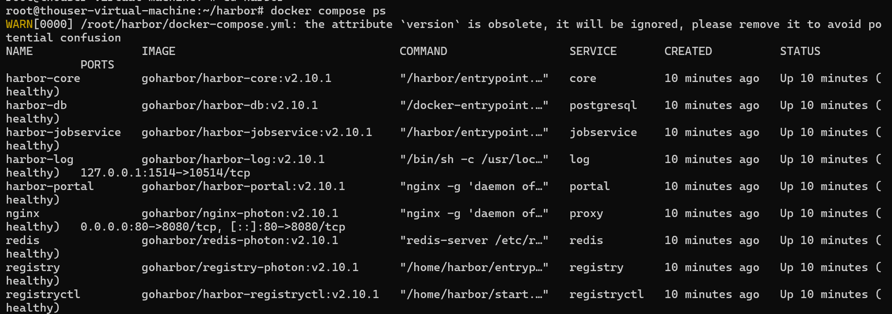

## **主题：Docker 与镜像仓库基础、Harbor、docker-compose 与容器故障**

## **学习目标：掌握虚拟化与 Docker 区别、Docker 安装、镜像、容器、registry，Dockerfile，docker-compose。理解Harbor 架构、docker-compose 服务启动和日志。**

## **当日任务：**

1. 根据学习目标展开学习
2. 实操任务：

   - 基于Ubuntu:22.04基础镜像构建一个带ssh，mysql-server的镜像，创建成实例，在实例内配置ssh，mysql服务。在不使用-p映射端口的情况下从容器外部访问。
3. 实操任务：

   - 通过docker-compose部署Harbor仓库，并熟悉其docker-compose.yaml的相关配置项
4. 实操任务：

   - 熟悉docker服务常规配置项，如何配置镜像加速，手动指定数据目录，以及如何配置远程访问等
5. 实操任务：

   - 熟悉docker服务数据目录结构，对于一个创建时带有-p 10022:22的容器如何不删除容器的情况下修改其映射配置。

## 我的进度：

### 一、虚拟化 vs 容器化核心区别

| 对比项   | 虚拟机(VM)             | 容器(Container)                 |
| -------- | ---------------------- | ------------------------------- |
| 内核     | 独立 Guest OS 内核     | 共享宿主机内核                  |
| 隔离级别 | 硬件级隔离（Hypervisor） | 进程级隔离（Namespace+ Cgroups） |
| 启动速度 | 分钟级                 | 秒级                            |
| 资源开销 | 大（完整 OS）          | 小（仅应用+ 依赖）              |
| 镜像大小 | GB 级                  | MB 级                           |

**容器隔离核心技术：**

- **Namespace**：进程隔离（PID、网络、挂载、UTS、IPC、用户）
- **Cgroups**：资源限制（CPU、内存、磁盘 IO、网络带宽）
- **UnionFS（联合文件系统）**：镜像分层，只读层 + 可写层叠加

### 二、实操任务 1：构建 SSH + MySQL 镜像

#### 首先安装docker

1. 安装依赖

```Shell
apt-get update
apt-get install -y ca-certificates curl gnupg lsb-release
```

2. 添加 Docker 官方 GPG 密钥

```Shell
install -m 0755 -d /etc/apt/keyrings
curl -fsSL https://download.docker.com/linux/ubuntu/gpg | gpg --dearmor -o /etc/apt/keyrings/docker.gpg
chmod a+r /etc/apt/keyrings/docker.gpg
```

3. 添加 Docker 软件源

```Shell
echo "deb [arch=$(dpkg --print-architecture) signed-by=/etc/apt/keyrings/docker.gpg] https://download.docker.com/linux/ubuntu $(lsb_release -cs) stable" | tee /etc/apt/sources.list.d/docker.list > /dev/null
```

4. 安装 Docker Engine

```Shell
apt-get update
apt-get install -y docker-ce docker-ce-cli containerd.io docker-buildx-plugin docker-compose-plugin
```

5. 验证安装

```Shell
docker --version
systemctl status docker
```

安装结果


**Docker 版本**: 29.6.2

**Docker Compose**: 已安装 (plugin版本)

**服务状态**: active (running)

记得配置镜像仓库

#### Dockerfile 编写

```Dockerfile
FROM ubuntu:22.04

ENV DEBIAN_FRONTEND=noninteractive

# 安装 SSH + MySQL + Supervisor
RUN apt-get update && apt-get install -y \
    openssh-server \
    mysql-server \
    supervisor \
    && rm -rf /var/lib/apt/lists/*

# 配置 SSH（重要：修改端口避免与宿主机22冲突，生成主机密钥）
RUN mkdir /var/run/sshd && \
    echo 'root:root123' | chpasswd && \
    sed -i 's/#PermitRootLogin prohibit-password/PermitRootLogin yes/' /etc/ssh/sshd_config && \
    (sed -i '/^#Port 22/s/.*/Port 2222/' /etc/ssh/sshd_config || true) && \
    grep -q '^Port 2222' /etc/ssh/sshd_config || sed -i '$a Port 2222' /etc/ssh/sshd_config
    ssh-keygen -A

# 配置 MySQL
RUN mkdir -p /var/run/mysqld && chown mysql:mysql /var/run/mysqld

# 使用 supervisord 管理多服务
COPY supervisord.conf /etc/supervisor/conf.d/supervisord.conf

EXPOSE 2222 3306

CMD ["/usr/bin/supervisord", "-n", "-c", "/etc/supervisor/supervisord.conf"]
```

**修正：**

1. 必须添加 `ssh-keygen -A` 生成SSH主机密钥，否则sshd无法启动

> OpenSSH sshd 服务启动时，必须存在以下密钥文件，否则直接启动失败：
>
> - `/etc/ssh/ssh_host_rsa_key`
> - `/etc/ssh/ssh_host_ecdsa_key`
> - `/etc/ssh/ssh_host_ed25519_key`
>
> `-A` = Auto，自动批量创建所有类型主机密钥，不需要交互式输入，非常适合 Dockerfile 自动化构建。

2. 修改SSH端口为2222，避免与宿主机的22端口冲突（使用host网络模式时会共享宿主机端口）
3. `mkdir -p` 避免目录已存在时报错

#### supervisord.conf

> Docker 容器默认只允许一个前台进程，多个服务必须借助 supervisor、s6 等进程管理工具。

```TOML
[supervisord]
nodaemon=true

[program:sshd]
command=/usr/sbin/sshd -D
autostart=true
autorestart=true

[program:mysqld]
command=/usr/sbin/mysqld
autostart=true
autorestart=true
```

#### 构建与运行

```Bash
# 构建镜像
docker build -t ubuntu-ssh-mysql:1.0 .

# 不使用 -p 端口映射，通过 host 网络模式实现外部访问
docker run -d --name ssh-mysql --network host ubuntu-ssh-mysql:1.0

# 验证SSH（端口2222）
sshpass -p 'root123' ssh -p 2222 root@localhost

# 验证MySQL
docker exec ssh-mysql mysql -u root -e "SELECT 'MySQL连接成功' AS status;"
```


**理解：**

- 不使用 `-p` 映射时，`--network host` 模式让容器直接使用宿主机的网络命名空间
- 容器内监听的端口即宿主机端口，但需避免与宿主机已有服务端口冲突
- 使用 `sshpass` 工具可以非交互式输入密码进行SSH测试

### 三、实操任务 2：docker-compose 部署 Harbor

#### Harbor 架构组成

```Plain
Proxy (Nginx)
  ├── Registry (镜像存储层)
  ├── Core (API + Web UI)
  ├── Jobservice (异步任务)
  ├── Database (PostgreSQL)
  ├── Redis (缓存/会话)
  ├── Chartmuseum (Helm Chart 仓库，可选)
  ├── Trivy (镜像扫描，可选)
  └── Notary (内容信任，可选)
```

#### docker-compose.yaml 核心配置解读

```YAML
version: '2.3'
services:
  proxy:
    image: goharbor/nginx-photon:${VERSION}
    ports:
      - 80:8080
      - 443:8443
    depends_on: [core]
    networks:
      - harbor

  registry:
    image: goharbor/registry-photon:${VERSION}
    volumes:
      - /data/registry:/storage
    networks:
      - harbor

  core:
    image: goharbor/harbor-core:${VERSION}
    depends_on: [registry, database, redis]
    networks:
      - harbor

  database:
    image: goharbor/harbor-db:${VERSION}
    volumes:
      - /data/database:/var/lib/postgresql/data
    networks:
      - harbor

  redis:
    image: goharbor/harbor-redis:${VERSION}
    volumes:
      - /data/redis:/var/lib/redis/data
    networks:
      - harbor

  jobservice:
    image: goharbor/harbor-jobservice:${VERSION}
    depends_on: [core]
    networks:
      - harbor

networks:
  harbor:
    driver: bridge
```

**关键配置项：**

| 配置项      | 作用         | 说明                     |
| ----------- | ------------ | ------------------------ |
| depends_on | 服务启动顺序 | 定义服务间的依赖关系     |
| volumes     | 数据持久化   | 将容器内数据映射到宿主机 |
| ports       | 端口暴露     | 仅Proxy暴露80/443端口    |
| networks    | 网络隔离     | 所有服务在同一网络内通信 |
| environment | 环境变量     | 配置数据库密码、密钥等   |

**实际执行情况：**

```Bash
# 服务状态
docker compose ps

# 健康检查
curl -s http://localhost/api/v2.0/health
```




**访问Harbor Web UI：**

- 地址: http://192.168.36.140
- 用户名: admin
- 密码: Harbor12345


#### 部署流程

```Bash
# 1. 下载 Harbor offline installer
wget https://github.com/goharbor/harbor/releases/download/v2.10.1/harbor-offline-installer-v2.10.1.tgz
tar xvf harbor-offline-installer-v2.10.1.tgz
cd harbor

# 2. 编辑 harbor.yml
cp harbor.yml.tmpl harbor.yml
# 修改以下配置：
# hostname: 你的IP或域名
# harbor_admin_password: Harbor12345
# data_volume: /data/harbor

# 3. 运行安装脚本（生成 docker-compose.yml）
./install.sh

# 4. 管理命令
docker-compose start/stop/restart
docker-compose logs -f [service_name]

# 5. 验证服务
docker-compose ps

# 6. 访问 Harbor Web UI
# 浏览器访问: http://你的IP
# 用户名: admin
# 密码: Harbor12345
```

**注意事项：**

- Harbor需要至少2GB磁盘空间用于存储镜像
- 确保80/443端口未被其他服务占用
- 需要能访问Docker Hub拉取Harbor镜像（或离线导入）
- 生产环境建议启用HTTPS并配置证书

### 四、实操任务 3：Docker 服务配置

#### 实际配置 /etc/docker/daemon.json

```JSON
{
  "registry-mirrors": [
    "https://mirror.ccs.tencentyun.com",
    "https://registry.docker-cn.com",
    "https://docker.m.daocloud.io"
  ],
  "hosts": ["unix:///var/run/docker.sock", "tcp://0.0.0.0:2375"],
  "log-driver": "json-file",
  "log-opts": {
    "max-size": "10m",
    "max-file": "3"
  }
}
```

> Docker 守护进程监听地址，两种接入方式：
>
> 1. `unix:///var/run/docker.sock`本地默认套接字，宿主机本地客户端通信，只能本机访问，安全。 `docker ps` 默认就是通过这个 sock 通信。
> 2. `tcp://0.0.0.0:2375` 开启TCP 远程 API，监听本机所有网卡的 2375 端口。  效果：其他机器可以远程操作这台宿主机的 Docker

| 配置项            | 作用     | 说明                                         |
| ----------------- | -------- | -------------------------------------------- |
| registry-mirrors | 镜像加速 | 从国内镜像源拉取，加速下载                   |
| hosts             | 远程访问 | unix socket+ TCP 端点，2375 明文 / 2376 TLS |
| log-driver/opts  | 日志管理 | 防止容器日志无限增长占满磁盘                 |

#### **实际配置步骤：**

```Bash
# 1. 创建systemd覆盖配置（移除 -H fd:// 参数）
mkdir -p /etc/systemd/system/docker.service.d
cat > /etc/systemd/system/docker.service.d/override.conf << 'EOF'
[Service]
ExecStart=
ExecStart=/usr/bin/dockerd
EOF

# 2. 重载systemd配置
systemctl daemon-reload

# 3. 编辑 /etc/docker/daemon.json，添加hosts配置
# "hosts": ["unix:///var/run/docker.sock", "tcp://0.0.0.0:2375"]

# 4. 重启Docker
systemctl restart docker

# 5. 验证远程访问
ss -tlnp | grep 2375
```

> Ubuntu/CentOS 使用 systemd 管理 docker 时，默认 docker.service 启动命令自带参数：
>
> ```Plain
> ExecStart=/usr/bin/dockerd -H fd:// --containerd=/run/containerd/containerd.sock
> ```
>
> 参数 `-H fd://` 会强制指定监听方式。
>
> 重大冲突： 如果在 `/etc/docker/daemon.json` 里写了 `"hosts": [...]`，dockerd 不允许同时从两处读取监听地址，直接启动失败
>
> 两种方案二选一：
>
> 1. 修改 service 文件，删掉 `-H fd://`
> 2. 不要在 daemon.json 写 hosts，改用 service 的 `-H` 参数指定远程端口

**实际验证结果：**

```Bash
ss -tlnp | grep 2375
```


**注意事项：**

- 配置远程访问前必须先修改systemd服务，否则会启动失败
- 2375端口为明文传输，生产环境应使用2376端口（TLS加密）
- 远程访问存在安全风险，建议配合防火墙限制访问IP

### 五、实操任务 4：Docker 数据目录结构 & 修改容器端口映射

#### /var/lib/docker 目录结构（实际查看）

```Plain
/var/lib/docker/
├── overlay2/       # 镜像层和容器层（联合文件系统）
├── containers/     # 运行时容器数据
│   └── <container_id>/
│       ├── config.v2.json      # 容器配置（含端口映射）
│       ├── hostconfig.json     # 主机配置（含端口绑定）
│       └── *.log               # 容器日志
├── volumes/        # Docker 管理的持久卷
├── network/        # 网络配置（bridge、overlay 等）
├── image/          # 镜像元数据（layer 映射、仓库信息）
└── buildkit/       # BuildKit 缓存
```

**查看命令：**

```Bash
# 查看目录结构
ls -la /var/lib/docker/

# 查看各目录大小
du -sh /var/lib/docker/*/

# 查看容器配置文件
CONTAINER_ID=$(docker inspect <容器名> --format '{{.Id}}')
ls -la /var/lib/docker/containers/$CONTAINER_ID/

# 查看端口映射配置
grep -o '"PortBindings":{[^}]*}' /var/lib/docker/containers/$CONTAINER_ID/hostconfig.json

# 查看容器日志
tail -f /var/lib/docker/containers/$CONTAINER_ID/*.log

# 查看Docker磁盘使用
docker system df
```

#### 不删除容器修改端口映射（以 -p 10022:22 改为 -p 20022:22 为例）

**方法一：直接修改配置文件（不推荐，Docker可能覆盖）**

```Bash
# 1. 停止容器
docker stop <container_id>

# 2. 停止 Docker 服务
systemctl stop docker

# 3. 编辑 hostconfig.json
# 找到 PortBindings 部分:
# "PortBindings":{"22/tcp":[{"HostIp":"","HostPort":"10022"}]}
# 修改为:
# "PortBindings":{"22/tcp":[{"HostIp":"","HostPort":"20022"}]}

# 4. 编辑 config.v2.json
# 找到 ExposedPorts 和 Ports 部分，同步修改 HostPort

# 5. 重启 Docker 服务
systemctl start docker

# 6. 启动容器
docker start <container_id>

# 7. 验证
docker port <container_id>
# 应输出: 22/tcp -> 0.0.0.0:20022
```

**方法二：使用 docker commit（推荐）**

```Bash
# 1. 停止并提交容器为新镜像
docker stop <container_id>
docker commit <container_id> new-image:tag

# 2. 删除旧容器
docker rm <container_id>

# 3. 使用新端口运行新镜像
docker run -d --name new-container -p 20022:22 new-image:tag

# 4. 验证
docker port new-container
```

**实际执行过程：**

```Bash
# 1. 创建测试容器（端口10022:22）
docker run -d --name test-container -p 10022:22 ubuntu-ssh-mysql:1.0

# 2. 查看原始端口映射
docker port test-container
22/tcp -> 0.0.0.0:10022
22/tcp -> [::]:10022

# 3. 停止容器
docker stop test-container

# 4. 提交为新镜像
docker commit test-container test-new-image:1.0

# 5. 删除旧容器
docker rm test-container

# 6. 使用新端口运行（端口20022:22）
docker run -d --name test-container-new -p 20022:22 test-new-image:1.0

# 7. 验证新端口映射
docker port test-container-new
22/tcp -> 0.0.0.0:20022
22/tcp -> [::]:20022
```

**实测注意事项：**

- 方法一在实际测试中发现Docker启动时可能覆盖配置文件，导致修改无效
- 方法二是官方推荐的做法，更可靠
- 如果容器使用了host网络模式修改端口，需要同时修改容器内服务的监听端口

### 六、Docker 网络模式总结

| 模式      | 命令                       | 特点                                          |
| --------- | -------------------------- | --------------------------------------------- |
| bridge    | 默认                       | 容器有独立网络命名空间，通过 docker0 网桥通信 |
| host      | --network host           | 共享宿主机网络栈，无隔离，性能最好            |
| none      | --network none           | 无网络，仅 lo 回环                            |
| container | --network container:NAME | 共享指定容器的网络命名空间                    |
| 自定义    | docker network create      | 内置 DNS 服务发现，容器间可通过名称通信       |

## 实操踩坑记录

| 问题                            | 原因                             | 解决方案                          |
| ------------------------------- | -------------------------------- | --------------------------------- |
| sshd启动失败（exit status 255） | 缺少SSH主机密钥                  | Dockerfile中添加`ssh-keygen -A` |
| host模式下SSH连接被拒绝         | 容器22端口与宿主机冲突           | 修改容器内SSH端口为2222           |
| 修改端口映射后不生效            | Docker启动时覆盖配置文件         | 使用`docker commit` 保存新镜像  |
| 容器内systemctl无法使用         | 容器PID 1不是systemd             | 使用supervisord管理多服务         |
| Docker镜像拉取失败              | 网络无法访问Docker Hub           | 配置镜像加速器或离线导入          |
| 配置远程访问后Docker启动失败    | systemd使用`-H fd://` 参数冲突 | 创建override.conf移除该参数      |
| Harbor离线安装包下载失败        | 网络速度慢，文件损坏             | 使用镜像加速器或离线导入          |

## 常用命令速查

| 操作           | 命令                                         |
| -------------- | -------------------------------------------- |
| 构建镜像       | `docker build -t <镜像名>:<标签> .`        |
| 运行容器       | `docker run -d --name <容器名> <镜像名>`   |
| host网络模式   | `docker run -d --network host <镜像名>`    |
| 查看容器日志   | `docker logs -f <容器名>`                  |
| 进入容器       | `docker exec -it <容器名> bash`            |
| 提交容器为镜像 | `docker commit <容器名> <新镜像名>:<标签>` |
| 查看Docker磁盘 | `docker system df`                         |
| 清理无用资源   | `docker system prune -a`                   |
| 查看端口映射   | `docker port <容器名>`                     |
| 重启Docker     | `systemctl restart docker`                 |
