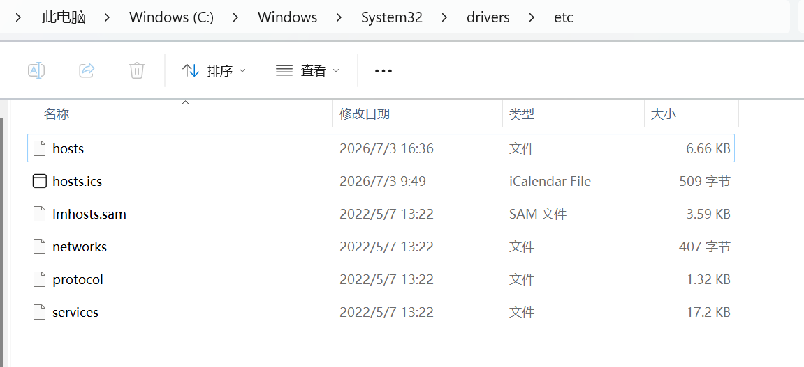
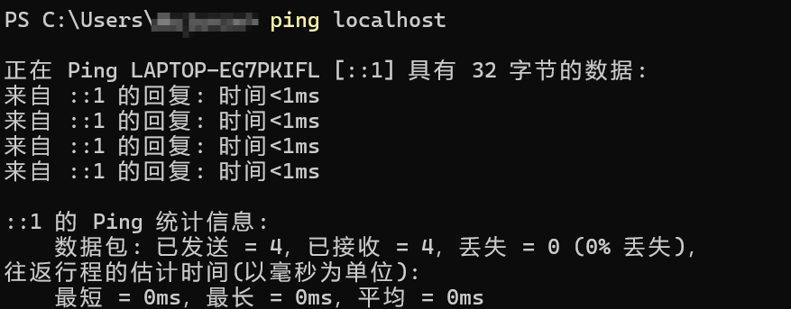

+++
date = '2026-07-03T17:03:25+08:00'
draft = false
title = '127.0.0.1和localhost的区别'
+++

#### 127.0.0.1和localhost的区别：

在开发和测试过程中，我们经常会用到 `localhost` 和 `127.0.0.1`。很多开发者习惯将它们混用，认为二者完全等价。虽然在大多数场景下它们确实可以互换，但深入理解它们的本质差异，有助于排查网络问题、提升对底层机制的认知。

### 什么是 localhost？

`localhost` 是一个域名，用于表示当前这台主机。当你在浏览器地址栏输入 `localhost` 时，操作系统会查询本地的 hosts 文件（Windows 下通常位于 `C:\Windows\System32\drivers\etc\hosts`，Linux/macOS 下位于 `/etc/hosts`），将域名解析为对应的 IP 地址。如果 hosts 文件中没有相关配置，则默认解析为 `127.0.0.1`。



**特点：**

- 是一个域名，而非 IP 地址
- 通过 DNS 或 hosts 文件解析，最终得到一个具体的 IP
- 不依赖网络连接，仅依赖本机的解析机制
- 适用于需要语义化地址的开发测试场景

### 什么是 127.0.0.1？

`127.0.0.1` 是 IPv4 协议中一个特殊的 IP 地址，被称为**回环地址（Loopback Address）**。它的作用是让数据包"回到本机"，不经过任何物理网络接口，直接在操作系统的网络栈内部完成收发。你可以把它理解为一种"自我通信"的机制。

值得注意的是，回环地址的范围是 `127.0.0.0/8`，即所有以 `127` 开头的 IP 地址都属于回环网络。例如 `127.0.0.2`、`127.0.0.3` 等地址同样指向本机，只是通常只使用 `127.0.0.1` 这一个。

**特点：**

- 是一个硬编码的 IP 地址，无需 DNS 解析
- 直接发送到本地网络栈，不经过任何网卡硬件
- 属于保留地址段，不能用于与外部设备通信
- 是 IPv4 专属地址，不涉及 IPv6 协议

### 相同点

- **都指向本机**：无论输入哪个，最终请求都会到达本机，而不会发往外部网络。
- **都用于本地测试**：在 Web 开发中，二者都是访问本机服务的标准方式。
- **无需网络支持**：即使电脑断网，两个地址都能正常工作，因为通信完全在本机网络栈内部完成。

### 核心区别

| 对比项 | localhost | 127.0.0.1 |
| --- | --- | --- |
| 本质类型 | 域名 | IP 地址 |
| 解析方式 | 需要通过 hosts 文件或 DNS 解析 | 直接使用，无需解析 |
| IPv6 支持 | 可解析为 IPv6 地址（::1） | 仅限 IPv4 |
| 速度 | 因涉及解析过程，理论上略慢 | 通常更快，省去了解析步骤 |
| 可配置性 | 可在 hosts 文件中自定义映射 | 固定为回环地址，不可修改 |

### 为什么有时表现不同？

在绝大多数情况下，`localhost` 和 `127.0.0.1` 行为一致。但在以下特殊场景中，二者可能出现差异：

#### 1. IPv6 环境的影响

现代操作系统中，`localhost` 可能被解析为 IPv6 地址 `::1`，而非 IPv4 的 `127.0.0.1`。如果你的应用程序仅支持 IPv4，使用 `localhost` 可能会因协议不匹配而导致连接失败。

可以使用以下命令验证本地的解析结果：

```bash
# Linux/macOS
dig localhost
# 或
ping localhost
```

比如我的电脑：



如果返回 `::1`，说明 `localhost` 被解析到了 IPv6 地址。

#### 2. hosts 文件配置异常

某些情况下，hosts 文件可能被第三方软件（如 VPN、代理工具、开发环境等）修改，导致 `localhost` 指向了其他地址。例如：

```plaintext
# hosts 文件中的异常配置
127.0.0.1   other-host
127.0.0.2   localhost
```

此时 `localhost` 可能解析为 `127.0.0.2`，而非预期的 `127.0.0.1`，导致服务访问异常。

#### 3. 防火墙或安全策略

部分防火墙或安全软件会区分对待域名和 IP 地址。例如，规则可能仅允许 `127.0.0.1` 通过，而拒绝 `localhost` 的访问请求，导致看似相同的地址产生不同的行为。

### 开发中如何选择？

- **使用 `localhost`**：优先推荐。它更具语义化，代码可读性更好。如果未来需要切换到 IPv6 环境，也无需修改代码。
- **使用 `127.0.0.1`**：当需要明确指定 IPv4，或排除 DNS 解析带来的不确定性时，直接使用 IP 地址更稳妥。

以下是一个简单的验证示例：

```python
import socket

# 查看 localhost 的解析结果
print(socket.gethostbyname('localhost'))
# 输出可能是 127.0.0.1 或 ::1，取决于系统配置

# 查看 127.0.0.1 的解析结果
print(socket.gethostbyname('127.0.0.1'))
# 始终输出 127.0.0.1
```

### 总结

| 一句话概括 | |
| --- | --- |
| localhost | 域名，经过解析指向本机，更具通用性和可维护性 |
| 127.0.0.1 | IP 地址，直连本机，更底层、更确定 |

理解二者的差异，不仅能在遇到网络问题时快速定位原因，也能帮助我们更清晰地认识 DNS 解析、回环地址、协议栈等底层网络概念。在实际开发中，根据场景合理选用即可。
