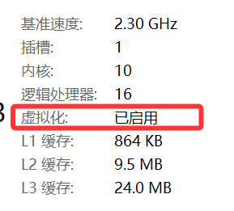
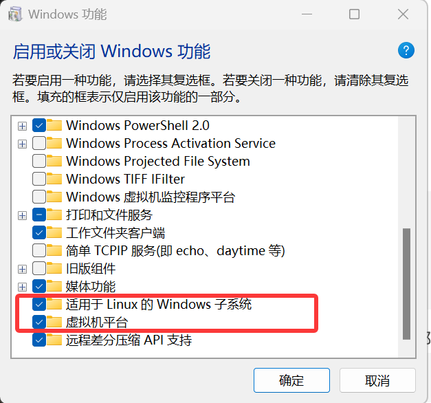
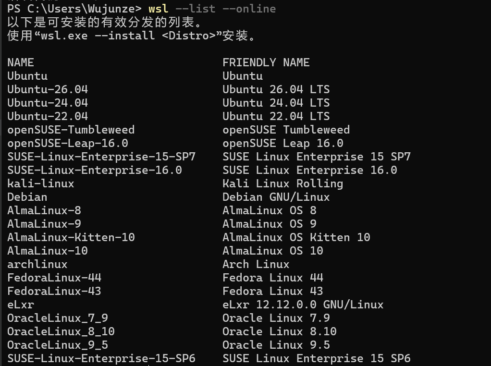
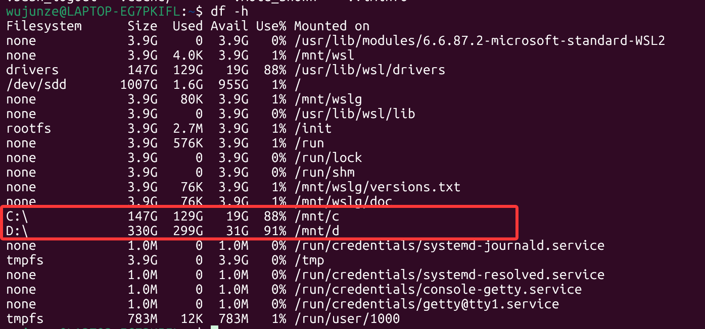
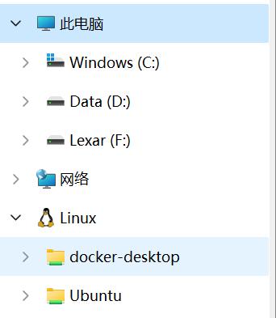
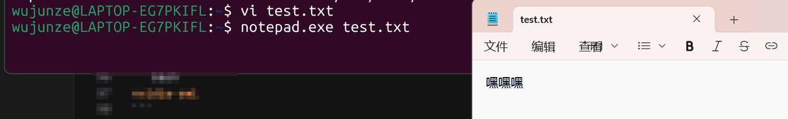
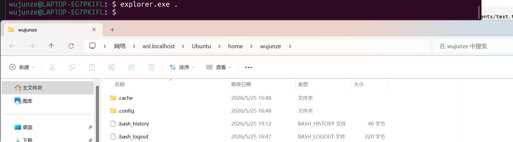
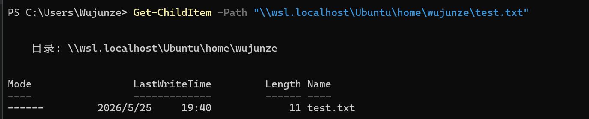
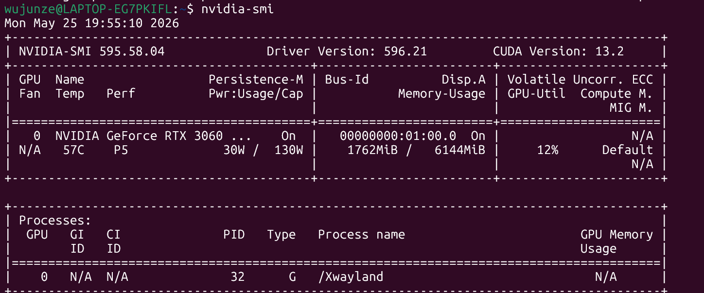

+++
date = '2026-05-25T19:51:51+08:00'
draft = false
title = 'WSL2相关指令'
+++

# WSL2 相关指令

## 一、前置条件

1. 打开任务管理器 → 性能 → CPU，确认虚拟化状态为已开启；若未开启，需进入BIOS界面手动开启虚拟化功能。
 


2. 任务栏搜索「启用或关闭Windows功能」，勾选以下两项：
   - 适用于Linux的Windows子系统
   - 虚拟机平台
  



## 二、系统安装步骤

1. 以管理员身份运行PowerShell
2. 执行安装命令
   ```powershell
   # 常规安装
   wsl --install
   # 国内网络推荐下载方式
   wsl --install --web-download
   ```
3. 默认安装Ubuntu系统，可执行命令查询全部可安装发行版
   ```powershell
   wsl --list --online
   ```


(我去，要翻墙)



## 三、常用操作命令

```powershell
# 查看已安装系统及版本
wsl --list -v

# 设置默认启动系统
wsl --set-default <系统名称>

# 切换打开指定系统
wsl -d <系统名称>

# 退出当前WSL系统
exit
# Windows终端终止指定系统
wsl --terminate <系统名称>

# 卸载指定Linux系统
wsl --unregister <系统名称>

# 导出系统镜像
wsl --export <系统名称> <导出文件名>

# 导入系统镜像
wsl --import <系统名称> <导入路径> <导出文件名>
```

## 四、跨系统文件共享

1. **Linux 访问 Windows C盘**
   Windows C盘自动挂载至WSL路径 `/mnt/c/`，该路径读写性能偏低，大文件建议拷贝至Linux本地目录使用。



2. **Windows 访问 Linux 文件**
   打开此电脑，点击侧边小企鹅图标，即可进入Ubuntu系统文件目录。



## 五、跨系统交互操作

- WSL内编辑文件后，可调用Windows程序打开：`notepad.exe test.txt`



- WSL内唤起Windows资源管理器：`explorer.exe .`




- PowerShell读取Linux挂载目录文件：
  ```powershell
  Get-ChildItem -Path /mnt/c/Users/<用户名>/Documents/test.txt -Force
  ```



- Linux端应用可直接在Windows桌面窗口运行展示

## 六、显卡互通调用

WSL可直接调用本机独显，Ubuntu终端执行显卡查询命令：

```bash
nvidia-smi
```

