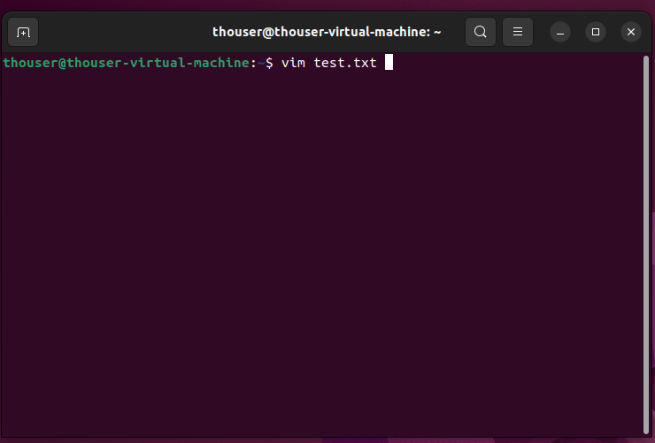
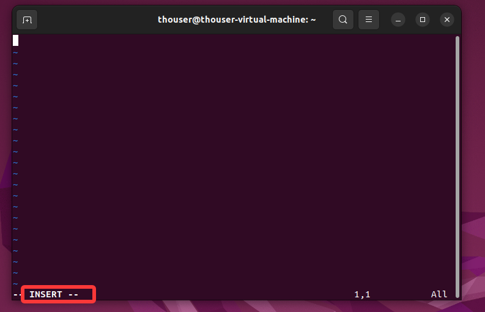
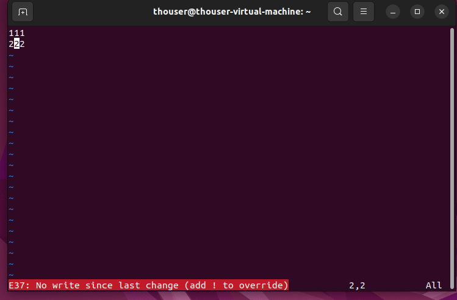
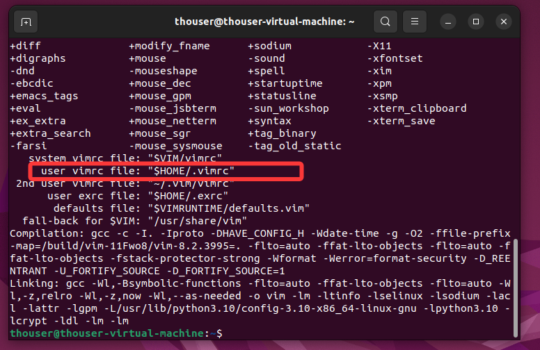
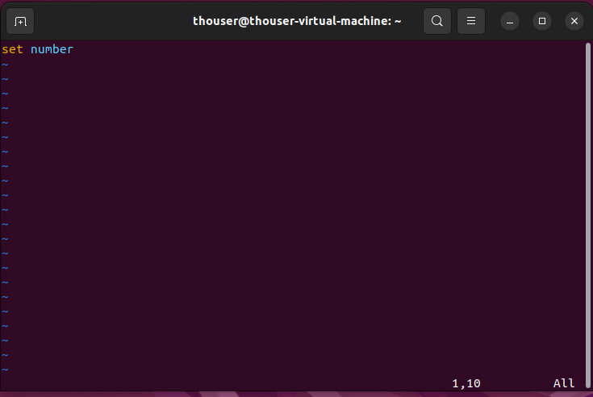
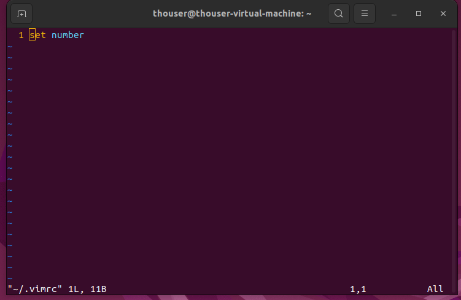

+++
date = '2026-07-24T10:00:00+08:00'
draft = false
title = 'Vim 编辑器入门'
+++

## 什么是 Vim？

Vim 是一款功能强大的文本编辑器，广泛应用于 Linux/Unix 系统和开发环境中。它以高效、轻量著称，是程序员和系统管理员的必备工具。

## 三种工作模式

Vim 的核心设计理念是**模式化编辑**，分为三种模式：

### 1. 正常模式（Normal Mode）

- 启动 Vim 后默认进入的模式
- 用于执行导航、删除、复制等编辑操作
- 按 `Esc` 可随时返回此模式

### 2. 编辑模式（Insert Mode）

- 用于输入和编辑文本
- 从正常模式按 `i` 进入
- 屏幕左下角会显示 `-- INSERT --` 提示

### 3. 命令行模式（Command-line Mode）

- 用于保存、退出、搜索替换等高级操作
- 从正常模式按 `:` 进入
- 命令会在屏幕底部显示

> **重要提示**：Vim 严格区分大小写，`A` 和 `a` 是完全不同的命令！

## 基本操作

### 打开/创建文件

```bash
vim 文件名.txt
# 或
vi 文件名.txt
```

如果文件不存在，保存退出时会自动创建。



### 模式切换流程

1. `vim 文件名` → 进入**正常模式**
2. 按 `i` → 进入**编辑模式**开始输入



3. 按 `Esc` → 返回**正常模式**
4. 按 `:` → 进入**命令行模式**
5. 输入 `wq` → 保存并退出
6. 输入 `q!` → 不保存强制退出

### 退出时的常见错误

如果编辑后直接输入 `:q` 会报错，因为 Vim 检测到文件已被修改。此时应：

- `:wq` — 保存并退出
- `:q!` — 放弃修改强制退出



## 光标移动与导航

### 基础移动（正常模式下）

| 按键  | 功能 |
| ----- | ---- |
| `h` | 左移 |
| `j` | 下移 |
| `k` | 上移 |
| `l` | 右移 |

> 小键盘方向键同样可用，但熟练掌握 `hjkl` 能大幅提升效率。

### 快速定位

| 按键   | 功能                        |
| ------ | --------------------------- |
| `G`  | 跳到文件最后一行            |
| `gg` | 跳到文件第一行              |
| `5j` | 向下移动 5 行（数字可替换） |
| `w`  | 跳到下一个单词开头          |
| `b`  | 跳到上一个单词开头          |
| `e`  | 跳到当前单词结尾            |

## 插入命令

| 按键  | 功能                                   |
| ----- | -------------------------------------- |
| `i` | 在光标**前**插入（insert）       |
| `a` | 在光标**后**插入（append）       |
| `I` | 在光标所在**行首**插入           |
| `A` | 在光标所在**行尾**插入           |
| `o` | 在**下方**新开一行并进入编辑模式 |
| `O` | 在**上方**新开一行并进入编辑模式 |

## 编辑操作

### 复制与粘贴

| 命令   | 功能               |
| ------ | ------------------ |
| `yy` | 复制当前行（yank） |
| `yw` | 复制一个单词       |
| `p`  | 粘贴到光标后       |

### 删除与修改

| 命令   | 功能                               |
| ------ | ---------------------------------- |
| `dd` | 删除当前行                         |
| `dw` | 删除一个单词                       |
| `cw` | 修改一个单词（删除并进入编辑模式） |

### 撤销与重做

| 命令         | 功能                     |
| ------------ | ------------------------ |
| `u`        | 撤销上一步操作           |
| `Ctrl + r` | 重做（恢复被撤销的操作） |
| `.`        | 重复上一次操作           |

## 搜索与替换

| 命令            | 功能                           |
| --------------- | ------------------------------ |
| `/关键词`     | 向下搜索关键词                 |
| `:%s/旧/新/g` | 全局替换（所有"旧"替换为"新"） |

## 显示行号

### 临时显示

在命令行模式下输入：

```vim
:set number
```

### 相对行号

```vim
:set relativenumber
```

显示相对行号后，可以快速跳转，如 `5j` 表示向下移动 5 行。


### 永久配置

每次打开 Vim 都显示行号，需要修改配置文件：

1. 查看 Vim 配置路径：

   ```bash
   vim --version
   ```

   找到 `sys vimrc file` 或 `user vimrc file` 的路径



2. 编辑配置文件：
   ```bash
   vim $HOME/.vimrc
   ```



3. 添加以下内容：

   ```vim
   set number
   ```
4. 保存退出后，重新打开 Vim 即可看到行号。



## 实用技巧

1. **数字前缀**：大多数命令可加数字前缀，如 `3dd` 删除 3 行，`10j` 下移 10 行
2. **组合操作**：`dG` 删除到末尾，`dgg` 删除到开头
3. **可视化模式**：按 `v` 进入，可块选文本后进行操作
